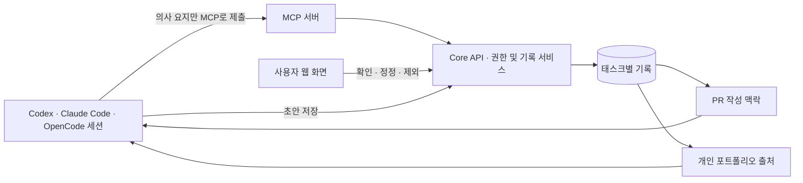

# AI 개발 의사결정 기록과 포트폴리오 상세 설계

작성일: 2026-09-23
상태: 상세 설계. 2026-09-23에 받은 세 가지 제품 선택을 반영했다.

## 1. 목표와 제품 원칙

이슈에 연결된 태스크를 AI 개발의 작업 단위로 삼는다. AI는 작업 전에 필요한 결정을 한 번에 질문한다. 사용자의 답변뿐 아니라 작업 방향 수정(steer), 구현 지시, AI를 사용하는 방식에 관한 지시까지 태스크에 구조화해 남긴다. 작업 중 AI가 스스로 판단한 중요한 내용도 별도 유형으로 남긴다. PR과 개인 포트폴리오는 이 기록을 출처로 사용한다.

1. **구현에 영향을 주는 사용자 입력을 폭넓게 기록한다.** 주요 선택, 명시적 답변, 방향 수정, 구현 방식 지시, AI 작업 방식 지시를 모두 포함한다. 중요도와 확인 방식은 AI가 내용에 맞춰 고른다.
2. **질문은 한 번에 모으되, 새로 발견된 결정은 작업 중 추가로 묻는다.** 초기 질문만으로 모든 변수를 안다고 가정하지 않는다.
3. **기록은 태스크에 귀속한다.** 프로젝트와 포트폴리오는 태스크 기록을 모아 보여 주는 읽기·편집 계층이다.
4. **사용자 입력과 AI 판단, 확인된 기록과 세션에서 수집한 기록을 구분한다.** MCP에는 대화 원문 대신 의사의 요지만 보낸다. AI가 요약·추정한 내용을 확인된 사용자 결정으로 표시하지 않는다.
5. **PR과 포트폴리오 문장은 출처로 되돌아갈 수 있어야 한다.** 근거 없는 성과·역할·날짜를 만들지 않는다. AI 활용 방식도 포트폴리오의 별도 주제가 될 수 있다.
6. **프로젝트 매니저가 통제하는 쓰기만 서버에서 강제할 수 있다.** 외부 AI 세션의 모든 셸 명령과 GitHub 직접 쓰기를 PM이 차단할 수는 없다. 안내 프롬프트의 절차와 서버의 기록·권한 규칙을 함께 사용한다.

## 2. 사용자와 확정한 범위

| 항목 | 확정된 방향 | 설계 반영 |
|---|---|---|
| 의사결정 방식 | AI가 내용에 따라 질문·기록·확인 방식을 고른다. 주요 결정은 후보를 제시하고 사용자에게 명시적 답을 받는 것이 기본이다. | 명시적 답변·steer·AI 작업 방식 지시는 MCP로 바로 기록할 수 있다. AI가 추론만 한 후보는 확인 대기로 둔다. PM 웹에서 재확인하는 절차는 선택할 수 있다. |
| 기록 범위 | 구현을 위한 모든 의미 있는 사용자 입력을 포함한다. | 제품 결과물과 직접 관련이 적은 AI 사용 지시도 `AI 협업 방식`으로 분류해 포트폴리오에 활용한다. |
| 세션 연결 | MCP를 통한 선별 기록을 먼저 구현한다. | 세션 대화 전문을 수집하지 않는다. 앞으로도 전문 수집은 기본 방향으로 삼지 않는다. |
| 포트폴리오 첫 결과 | 비공개 편집 초안과 Markdown 내보내기. | 공개 페이지와 블로그 직접 발행은 후속 단계로 둔다. |

AI가 기록 방식을 고르더라도 서버는 `세션에서 수집`과 `사용자가 PM에서 확인`을 같은 확실성으로 표시하지 않는다. 이는 AI의 재량을 유지하면서 포트폴리오의 출처를 분명하게 하는 규칙이다. 사용자의 사적인 표현이나 공적 글에 부적합한 말투가 PM 기록·PR·포트폴리오로 옮겨 가지 않도록, MCP 입력은 의사결정의 요지로 정리한다. 사용자가 특정 내용을 원문으로 남기라고 직접 요청한 경우에만 별도 웹 입력으로 원문을 기록한다.

## 3. 현재 코드에서 확인한 접점

| 현재 구현 | 설계상 사용법 |
|---|---|
| `Task`에 `notes` 한 덩어리, `ChangeLog`에 필드 변경 이력 | 의사결정 전용 모델을 둔다. 자동 저장되는 메모와 변경 이력은 분류·확인 상태·사유·정정 관계를 표현하기 어렵다. |
| `RepoIssue`, `TaskGitLink`에 이슈·브랜치·PR 번호 | 연결된 이슈를 작업 근거와 PR 출처로 사용한다. 연결이 없는 기존 태스크도 기록 열람은 허용한다. |
| `mcp_server/skill/SKILL.md`가 `get_guide`와 MCP 자원으로 노출 | 단일 원본 안내문을 확장하고, 질문·기록·PR·포트폴리오 프롬프트를 같은 안내문에서 참조한다. |
| `get_governance`, `get_settings`, 조직별 AI 쓰기 정책 | 의사결정 기록 쓰기도 같은 조직 권한과 AI 정책을 따른다. |
| 태스크 패널, 개인 `내 태스크`, 조직 `팀` 화면 | 태스크 패널에 기록을 배치하고 개인 영역에 포트폴리오 진입점을 둔다. 팀 화면은 관리자 전용이므로 개인 포트폴리오의 주 진입점으로 사용하지 않는다. |
| `pr_compare_url`의 `Closes #N` 기본 본문 | PR 초안에서 이슈 닫기 문구와 `TASK-N`을 보존한다. |
| 기본 거버넌스 5절의 “결정은 회의록에 남기고 태스크에서 링크” | 사용자 의사결정은 태스크 전용 기록으로 남기도록 개정한다. 회의록은 집단 논의의 맥락에 사용한다. |

## 4. 업무 흐름



### 4.1 이슈와 태스크 준비

1. AI가 `get_guide` → 조직 확인 → `get_governance`·`get_settings` → 관련 프로젝트 문서·이슈를 읽는다.
2. 이슈를 가져오거나 기존 태스크에 이슈를 연결한다. 새 개발 작업에서 이슈가 없다면 이슈 생성 또는 사용자에게 이슈 범위 확인을 요청한다.
3. 태스크의 목표, 범위, 완료 조건, 체크리스트를 확인한다. 이 시점에 사용자가 이미 결정한 내용과 미결정 사항을 구분한다.
4. AI는 중복을 제거한 질문 묶음을 만든다. 기술 선택, 범위, 데이터·호환성, 운영·배포, 성공 기준처럼 실제로 선택이 필요한 것만 묻는다. 선택지마다 영향과 AI의 제안을 짧게 적는다. 사용자가 이미 방향을 정했거나 지시한 사항은 다시 묻지 않는다.
5. 사용자가 답하면 AI는 구현에 필요한 의사의 요지를 중립적인 문장으로 정리해 `세션에서 수집`으로 기록한다. 중요한 선택이라도 사용자가 질문에 명시적으로 답했다면 다시 웹에서 승인받을 필요는 없다. AI가 맥락에서 추론만 한 선택은 `확인 대기` 후보로 둔다. 대화 메시지를 통째로 옮기지 않는다. 답이 없는 항목은 `미결정`으로 남긴다.

### 4.2 실행 중 기록

1. AI는 구현에 영향을 주는 사용자 입력을 `주요 선택`, `요구·제약`, `명시적 답변`, `방향 수정`, `구현 방식 지시`, `AI 협업 방식 지시`로 분류한다. 인사말·반복 표현·비밀값처럼 결정 근거가 되지 않는 내용은 기록하지 않는다.
2. PM 화면은 질문의 요지·사용자 의사의 요약·기록 유형·확인 근거를 보여 준다. 사용자는 수집 기록을 웹에서도 확인·정정·제외할 수 있다. AI의 추론에 머문 주요 선택은 확인 대기 목록에서 검토한다.
3. 확인된 기록에는 실제로 확인한 사용자 계정과 서버 시각을 붙인다. AI가 제출한 행위자 정보만으로 `사용자 확인`을 만들지 않는다.
4. 작업 중 새 선택이 필요하면 해당 태스크에서 추가 질문을 만들고 같은 절차를 반복한다. 사용자의 steer는 기존 결정의 변경인지 단순 보충인지 AI가 판단해 연결한다.
5. AI가 자율 처리한 중요한 구현·운영 판단은 `AI 작업 판단`으로 별도 기록한다. 이 유형에는 “사용자가 결정함”을 표시하지 않는다.
6. 사용자의 입력이 이전 결정을 바꾸면 기존 기록을 덮어쓰지 않고 새 기록이 이전 기록을 대체하도록 연결한다. PR·포트폴리오에는 변경 과정과 최신 유효 결정을 함께 설명할 수 있다.

### 4.3 PR과 포트폴리오

1. PR 작성 시 연결된 태스크의 사용자 입력과 AI 작업 판단, 이슈·코드 변경·검증 사실을 시간순으로 읽어 초안을 만든다. `사용자 확인`과 `세션에서 수집` 표기를 유지한다. 제품 변경과 직접 관계없는 AI 협업 방식 지시는 PR 관련성에 따라 포함한다.
2. 사람이 PR 문구를 검토·편집한 뒤 기존 GitHub 작성 흐름으로 보낸다. `Closes #N`, `TASK-N`은 유지한다.
3. 개인 포트폴리오에서 사용자가 프로젝트·기간·포함할 기록을 고른다. AI가 선택한 근거만으로 Markdown 초안을 만들고, 사용자가 내용을 편집·내보낸다.

기록 예시는 다음과 같다. 문장들은 PM에 저장할 **요지**의 예시이며 실제 대화 인용문이 아니다.

| 상황 | 기록 유형 | 저장할 요지 | 상태 |
|---|---|---|---|
| 질문에 명시적으로 기술을 선택 | 주요 선택 | 이 태스크는 기존 PostgreSQL 저장소를 활용한다 | `captured` |
| 작업 중 구현 방향을 수정 | 방향 수정 | 신규 인증 모듈 대신 기존 인증 흐름을 재사용한다 | `captured`, 이전 기록 대체 가능 |
| AI에게 질문 방식을 지시 | AI 협업 방식 | 설계 전에 필요한 결정을 한 번에 질문하고 답변을 계획에 반영한다 | `captured` |
| AI가 사용자 답변 없이 중요 선택을 추론 | 주요 선택 후보 | 기존 API 계약을 유지할 것으로 추정한다 | `proposed`, 구현 근거로 확정하지 않음 |
| AI가 세부 구현을 자율 선택 | AI 판단 | 기존 서비스 함수에 검증을 추가한다 | `recorded` |

## 5. 데이터 모델

### 5.1 `TaskDecisionRecord`

`tasks` 앱에 추가한다. 기록은 하나의 태스크에만 속하며 조직은 `task.project.org`에서 얻는다.

| 필드 | 형식과 규칙 |
|---|---|
| `id`, `task_id` | PK, FK. 태스크별 `created_at,id` 정렬 인덱스 |
| `kind` | `user_input` 또는 `ai_judgment`. 두 종류를 합치거나 종류만 바꿔 소유를 옮길 수 없다. |
| `input_type` | 사용자 입력: `major_choice`, `requirement`, `answer`, `steer`, `implementation_instruction`, `ai_workflow_instruction`. AI 판단에는 적용하지 않는다. |
| `status` | 사용자 입력: `captured`(명시적 입력의 요지), `proposed`(AI가 추론한 후보의 확인 대기), `confirmed`(PM 웹에서 추가 확인), `rejected`, `superseded`; AI 판단: `recorded`, `superseded` |
| `question_summary`, `summary` | 질문이 있었다면 그 요지, 사용자의 의사 또는 AI 판단의 요지. 메시지 전문을 넣지 않는다. `summary`는 비워 둘 수 없다. |
| `reason_summary`, `alternatives`, `impact_summary` | 사용자가 실제로 밝힌 이유, 검토한 대안, 작업에 미친 영향의 요약. 이유가 확인되지 않으면 비워 두고 AI가 추측해 채우지 않는다. |
| `recorded_by`, `subject_user`, `confirmed_by` | 기록한 계정, 입력을 한 것으로 귀속된 계정, PM 화면에서 실제로 확인한 계정. MCP 개인 토큰이면 `subject_user`는 토큰 소유자로 한정하고 `confirmed_by`는 비운다. 공유·봇 토큰은 사용자 입력 귀속에 쓰지 않는다. |
| `evidence_basis` | `explicit_reply`, `explicit_instruction`, `inferred`. AI가 파악한 명시적 답변과 해석상 추론을 구분한다. MCP가 제출한 근거는 AI의 주장으로 표시하고 웹 재확인과 혼동하지 않는다. 웹 재확인은 `status`, `confirmed_by`, `confirmed_at`에 남긴다. |
| `source` | `web`, `api`, `mcp`. API 토큰의 소유 사용자와 사람이 웹에서 확인한 사용자를 혼동하지 않는다. |
| `client_name`, `session_ref` | 선택적 출처 메타데이터. 세션 내부 참조는 사용자에게 도움이 될 때만 저장한다. 대화 본문이나 비밀값을 넣지 않는다. |
| `verbatim_text` | 기본값은 비움. 사용자가 특정 기록의 원문 보관을 직접 요청하고 PM 웹 화면에서 입력한 경우에만 저장한다. 일반 MCP 기록 스키마에는 이 필드가 없다. |
| `supersedes_id` | 변경된 결정이 어떤 과거 기록을 대체하는지 가리키는 자기 FK |
| `created_at`, `confirmed_at`, `source_time` | 앞의 두 값은 서버 UTC 시각. `source_time`은 세션에서 알 수 있을 때만 넣는 참고 시각이며 검증된 확정 시각처럼 쓰지 않는다. 화면에는 KST로 보여 준다. |
| `client_request_id` | 같은 MCP 재시도 중 중복 생성을 막는 사용자·태스크 범위의 고유 키 |

기록 요지와 확정자·확정 시각은 확정 뒤 수정하지 않는다. 정정은 새 기록으로 남기고 `supersedes_id`로 이력을 잇는다. 후보와 수집 기록은 귀속 사용자가 정정하거나 제외할 수 있다. AI 판단을 사용자 입력으로 `kind`만 바꾸는 작업은 금지한다.

서비스 검증 규칙은 다음과 같다. `captured`에는 `explicit_reply` 또는 `explicit_instruction`, `proposed`에는 `inferred`를 사용한다. `confirmed`는 이전 근거값을 유지한 채 `confirmed_by`·`confirmed_at`을 채운다. `supersedes_id`는 같은 태스크의 앞선 기록만 가리키고 순환을 허용하지 않는다. MCP 요약 필드는 길이를 제한한다(`question_summary` 300자, `summary` 800자, `reason_summary`·`impact_summary` 각각 500자). 이는 대화 전문 붙여 넣기를 어렵게 하는 상한이며, 요약의 적절성은 AI 안내와 사용자 검토로 관리한다.

개인 포트폴리오에서 `confirmed`는 `confirmed_by`, `captured`는 `subject_user`를 기준으로 후보를 고른다. 후자는 `세션에서 수집한 입력`이라고 표기하고 사용자가 생성 전에 제외·정정할 수 있게 한다. 태스크 담당자·생성자가 같다는 이유만으로 그 사람의 결정이라고 보지 않는다. 다른 사용자의 입력은 프로젝트 맥락으로만 보이며 해당 사용자의 개인 성과로 쓰지 않는다.

### 5.2 `PortfolioDraft`와 `PortfolioSource`

`PortfolioDraft`는 `owner`, `org`, `title`, `scope_json`(프로젝트·기간·기록 유형 필터), `body_md`, `status=draft`, `prompt_version`, `version`, `created_at`, `updated_at`을 갖는다. `version`은 동시 편집 충돌 확인에 쓴다. 첫 단계에는 공개 상태를 두지 않는다.

`PortfolioSource`는 초안과 선택한 `TaskDecisionRecord`를 연결하고, 생성 시점의 기록 종류·**의사 요지**·확인 상태·시각·태스크 번호·프로젝트명을 작은 스냅샷으로 보존한다. 예외적으로 보관한 `verbatim_text`도 이 스냅샷에는 자동 복사하지 않는다. 기록이 나중에 정정되면 초안에 “근거가 변경됨”을 표시하고 사용자가 새로 생성할 수 있게 한다. 사용자가 직접 편집한 문장은 자동 재생성으로 덮어쓰지 않는다.

저장된 초안은 소유자만 조회·수정한다. 원본 태스크의 조직 접근 권한이 사라지면 그 출처가 든 초안의 조회·수정·내보내기를 중단하고, 다시 접근할 수 있을 때 재개한다. 기존 초안의 보존 기간과 삭제 요청 처리는 조직 데이터 정책에 따라 별도 운영 규칙으로 정한다.

## 6. API·서비스·MCP 계약

업무 검증은 `tasks/services.py`와 별도 포트폴리오 서비스 함수에 둔다. API와 웹 뷰는 입력·응답만 처리한다.

| 경로 또는 도구 | 입력·결과와 핵심 규칙 |
|---|---|
| `GET /api/tasks/{id}/decisions` / `list_task_decisions` | 태스크 접근 권한 검사 후 종류·상태·확정자·출처를 시간순 반환. 페이지네이션 제공 |
| `POST /api/tasks/{id}/decisions` / `record_task_decision` | `kind`, `input_type`, 질문·의사·이유·영향의 **요약**, `evidence_basis`, 세션 참조, `client_request_id`. MCP는 명시적 답변·지시를 `captured`, AI가 추론한 후보를 `proposed`로 제출. 대화 원문 필드는 받지 않음 |
| `POST /api/tasks/{id}/decisions/{record_id}/confirm` | 브라우저 세션의 로그인 사용자가 추론 후보를 확정하거나 수집 기록을 추가 확인. 명시적으로 답한 결정을 다시 웹에서 확인하도록 강제하지 않음 |
| `POST /api/tasks/{id}/decisions/{record_id}/reject` | 이유와 함께 후보 또는 수집 기록 제외. 원본 삭제 대신 상태 변경 |
| `POST /api/tasks/{id}/decisions/{record_id}/supersede` | 정정 내용으로 새 기록 생성. 이전 기록·대체 관계 유지 |
| `GET /api/tasks/{id}/pr-context` / `get_pr_context` | 확정된 결정, 세션에서 수집한 명시적 입력, AI 판단, 이슈·PR 링크와 출처 id. 각 기록의 확인 수준을 표시. 확인 대기·제외·대체된 기록은 초안 본문에 넣지 않음. 코드 작업의 연결 이슈가 없으면 작성 맥락 생성을 중단하고 연결을 안내. 실제 코드 변경·검증 결과는 작성 세션이 작업 환경에서 별도로 확인 |
| `GET /api/me/portfolio-sources` | 로그인 사용자의 `confirmed`·`captured` 입력을 프로젝트·기간·`input_type`으로 필터. 같은 조직의 AI 판단은 프로젝트 맥락으로 선택 가능 |
| `POST /api/me/portfolio-drafts` | 선택한 출처 id 목록과 초안 본문을 저장. 서버에서 소유권·조직 권한·출처 일치 재검사 |
| `GET/PATCH /api/me/portfolio-drafts/{id}` | 본인 초안 조회·편집. 버전 충돌 시 409. Markdown 내보내기는 본인에게만 제공 |

AI 세션의 대화 기록은 PM 서버에 자동 전달되지 않는다. MCP 클라이언트의 AI가 구현 관련 입력의 **의사 요지**를 선별·정리해 위 도구를 호출한다. MCP 스키마의 필드 이름과 설명에 `summary`, `reason_summary`, `question_summary`를 쓰고, “메시지 전문·긴 인용·사적 표현을 붙여 넣지 말 것. 사용자가 명시적으로 원문 보관을 요청한 경우 웹 화면에서 별도로 입력할 것”을 명시한다. 서버는 대화 배열·대형 문자열·비밀값으로 보이는 입력을 거부하거나 검토 대상으로 돌리되, 자동 판별만으로 완전한 개인정보 차단을 보장한다고 말하지 않는다. `client_name`과 `session_ref`만으로 사람의 결정을 인증하지 않는다.

`ai.enabled`가 꺼진 조직의 MCP 제안·AI 판단 기록은 거부한다. 기존 `ai.edit_text` 정책과 혼동하지 않도록 `ai.record_work`를 별도 정책 키로 추가한다. 사용자 본인의 웹 확인·열람은 이 AI 정책의 대상이 아니다.

## 7. 프롬프트 계약

### 7.1 작업 시작 프롬프트

`mcp_server/skill/SKILL.md`를 단일 원본으로 유지하고 `get_guide`·`guide://sandol-pm`에서 같은 내용을 제공한다. 안내문은 다음 순서를 요구한다.

> 현재 조직의 거버넌스·설정·관련 문서와 연결된 이슈·태스크를 먼저 읽는다. 이미 명시된 사용자 결정을 중복 질문하지 않는다. 구현에 영향을 주는 미결정 사항만 중요도순으로 묶어 한 번에 질문한다. 각 질문에는 선택지, 차이, 권장안, 결정하지 않았을 때의 영향을 적는다. 사용자가 명시적으로 답했다면 그 의사의 요지를 태스크에 기록한다. 답이 없거나 AI가 추론한 선택은 확인 후보로 남긴다. 답변·방향 수정·구현 지시·AI 활용 지시도 기록한다. 대화 메시지, 개인적 말투, 긴 인용문은 PM에 전송하지 않는다. 작업 중 새 선택이 나오면 추가 질문한다.

질문 묶음의 출력 형식은 `번호 / 질문 / 선택지별 영향 / 권장안과 이유 / 답변 필요 여부`로 고정한다. “권장안”은 AI의 제안이고 사용자의 선택으로 기록하지 않는다. 같은 메시지에서 답할 수 있게 묶되, 긴 선택지 목록 때문에 사용자의 판단이 어려워지면 관련 항목을 합친다.

### 7.2 기록 제출 프롬프트

> 구현에 영향을 주는 사용자의 명시적 입력을 `user_input`의 `captured` 상태로 기록한다. 주요 설계 선택이라도 사용자가 질문에 명시적으로 답했다면 같은 방식으로 기록한다. AI가 맥락만 보고 추론한 후보는 `proposed`로 제출해 확인받는다. steer·구현 지시·AI 작업 방식 지시도 기록한다. 메시지를 그대로 복사하거나 대화 전문을 전송하지 않는다. 의사의 요지를 짧고 중립적인 문장으로 바꾸되, 사용자가 정한 범위·수치·금지 사항은 빠뜨리지 않는다. 질문과 이유도 필요한 요지만 적고, 이유를 듣지 않았다면 빈 값으로 둔다. 사용자가 원문 보관을 직접 요청했을 때는 PM 웹 화면의 별도 입력 절차를 안내한다. AI가 별도로 정한 기술적 세부는 `ai_judgment`로 기록하고 선택 이유와 적용 범위를 적는다. 같은 내용을 중복 제출하지 않는다. 이전 결정을 변경했다면 대체 관계를 지정한다.

MCP 도구 설명과 요청 스키마에도 같은 규칙을 넣는다. `summary`는 “사용자의 의사 요지”, `reason_summary`는 “사용자가 밝힌 이유의 요지”, `session_ref`는 “선택적 세션 참조”로 설명하고 `message`, `transcript`, `raw_text` 입력을 제공하지 않는다. 예: 사용자가 “앞으로 이 방향 말고 기존 인증을 재사용해”라고 말했다면 `input_type=steer`, `summary=기존 인증 체계를 재사용하도록 구현 방향을 변경`으로 기록한다. 말투나 주변 대화는 저장하지 않는다.

### 7.3 PR 작성 프롬프트

> `get_pr_context`를 읽고 PR 본문을 작성한다. 첫 단락은 이번 작업의 목적과 연결 이슈, 다음에는 시간순으로 사용자가 정한 주요 선택·방향 수정·구현 지시와 그 결과, 그 다음에는 AI가 자율적으로 판단한 구현 사항, 마지막에는 실제 검증 결과와 남은 제약을 쓴다. 코드 변경과 검증 결과는 현재 작업 환경에서 확인한 사실만 쓴다. 각 중요한 기록에는 `TASK-N · 기록 #ID`를 출처로 붙인다. `captured` 기록은 세션에서 요약해 수집한 입력으로 취급하고 `confirmed`와 동일하게 확인받았다고 표현하지 않는다. 확인 대기 후보를 확정 결정으로 쓰지 않는다. 사적인 대화 원문은 PR에 옮기지 않는다. `Closes #N`과 `TASK-N`을 유지하고 PR을 올리기 전에 사용자에게 결과를 보여 기존 승인 절차를 따른다.

PR 템플릿:

```markdown
## 목적
- 이슈: #N · TASK-N

## 사용자가 정한 방향
- YYYY-MM-DD — 결정·방향 수정·구현 지시의 요지와 이유. 적용 결과. (TASK-N · 기록 #ID, 확인 상태)

## AI가 처리한 판단
- 내용과 선택 이유. (TASK-N · 판단 #ID)

## 구현 및 확인
- 변경 사항
- 실제 확인한 결과
- 남은 제약

Closes #N
```

### 7.4 포트폴리오 생성 프롬프트

> 선택된 출처 묶음으로 프로젝트의 문제, 사용자의 역할, 주요 선택, 방향 수정, 구현·운영 결과를 시간순 이야기로 쓴다. `ai_workflow_instruction`은 AI를 어떻게 활용하고 통제했는지 설명하는 별도 주제로 사용할 수 있다. `confirmed_by` 또는 `subject_user`가 본인이 아닌 입력은 본인의 의사결정으로 서술하지 않는다. `captured` 기록은 세션에서 요약해 수집한 내용이므로 확정된 발언처럼 직접 인용하지 않는다. AI 판단은 AI가 처리한 일로 표기한다. 출처에 없는 기술 숙련도·성과 수치·운영 결과는 만들어 쓰지 않는다. 조직 정보와 민감 내용을 사용자가 초안에서 검토·제외할 수 있게 한다. 각 단락에는 근거가 된 태스크·기록 id를 초안 메타데이터로 연결한다. 결과는 제목, 개요, 문제, 의사결정 과정, AI 협업 방식, 구현·운영, 결과, 배운 점 구조의 Markdown 초안이다.

초기 AI 생성 경로는 이미 연결된 Codex·Claude Code·OpenCode MCP 세션이다. PM은 출처 묶음과 프롬프트를 제공하고, AI가 생성한 Markdown을 사용자가 비공개 초안으로 저장·수정한다. 서비스 안에서 버튼 한 번으로 모델을 호출하려면 모델 제공자·비용·비밀키·실패 재시도 정책을 정한 뒤 별도 단계로 추가한다. 첫 화면의 `내 포트폴리오 만들기`는 출처 선택·프롬프트 복사·초안 저장 흐름을 연다.

## 8. 화면 설계

### 8.1 태스크 패널

진행 메모 아래에 **사용자 의사결정과 AI 판단** 영역을 둔다. 두 유형을 별도 탭 또는 목록 헤더로 구분한다. 사용자 기록은 `주요 선택`, `답변`, `방향 수정`, `구현 지시`, `AI 협업 방식` 등으로 필터링한다. 기록 카드에는 질문·의사·이유의 요지, `세션에서 수집/사용자 확인` 상태, 작성·확정 시각, 확정자, AI 도구, 이전 결정과의 연결을 보인다. `확인 대기 N건`을 패널 상단에 표시한다. 사용자는 후보와 수집 기록을 확인·정정·제외하고 AI 판단을 열람할 수 있다. 확정된 내용의 정정은 새 버전으로 처리한다.

### 8.2 개인 포트폴리오

주 진입점은 개인 메뉴의 **내 포트폴리오**로 둔다. 조직의 `팀` 탭은 관리자만 볼 수 있고, 개인 기록을 만드는 주체는 각 사용자이기 때문이다. 필요하면 `내 태스크`에 바로가기를 추가한다.

화면 단계는 `조직·프로젝트·기간·포트폴리오 주제 선택 → 기록 선택 및 민감 내용 제외 → AI용 출처 묶음 생성 → Markdown 초안 검토·편집 → 내보내기`다. 주제는 `프로젝트 구현 과정`과 `AI 협업 방식`을 제공한다. 프로젝트별 타임라인에서 `내 입력`과 `AI 판단`, `세션에서 수집`과 `사용자 확인`을 구분한다. 두 유형의 내 입력이 모두 없다면 “해당 기간에 기록된 사용자 입력이 없습니다”를 보여 준다.

## 9. 권한·데이터 보호·정합성

- 기록 읽기는 기존 태스크와 같은 조직 가시성 규칙을 따른다. 기록 제안은 활성 조직 멤버와 쓰기 범위의 개인 토큰만 가능하다. `user_input` 확인은 귀속된 로그인 사용자 자신의 웹 세션에서만 가능하다.
- AI가 사용자 이름이나 답변 시각을 제출해도 서버는 `confirmed_by`와 `confirmed_at`을 그 값으로 채우지 않는다. AI 세션 id 역시 인증 근거가 아니다.
- 질문·의사 요지·PR·포트폴리오 본문은 외부 입력이다. HTML 렌더링 시 이스케이프하고 AI에게 전달할 때 지시가 아닌 자료로 경계를 명시한다.
- 세션 대화 전체, 개별 메시지 원문, API 토큰, 비밀값, 민감한 파일 내용은 MCP 기록에 보내지 않는다. MCP 스키마에 전문 입력 필드를 두지 않는다. 사용자가 특정 기록의 원문 보관을 명시적으로 요청한 경우에만 본인이 웹에서 입력하고 길이 제한과 공개 전 검토를 적용한다.
- 예외적으로 저장한 `verbatim_text`는 일반 목록·`get_pr_context`·포트폴리오 출처 묶음에 포함하지 않는다. 사용자가 별도 웹 화면에서 그 기록을 열 때만 보여 준다.
- 페이지 목록은 `task_id,created_at,id`와 `confirmed_by,confirmed_at` 인덱스로 조회한다. 태스크 수가 많아도 포트폴리오 출처 목록을 전체 로딩하지 않는다.
- 태스크 삭제는 기존에 조직 관리자가 수행할 수 있다. 기록·포트폴리오 출처가 붙은 태스크를 삭제할 때의 보존·익명화·내보내기 규칙은 구현 전 확인한다. 기본 설계는 참조가 있는 태스크 삭제를 거부하고 보관·취소를 안내한다.
- 서버가 강제할 수 있는 경계는 PM API의 기록 상태와 권한이다. 외부 GitHub UI·CLI에서 사용자가 직접 PR을 열면 PM의 사전 검토를 강제하지 못하므로 안내문과 PR 템플릿으로 보완한다.

## 10. 구현 순서와 완료 기준

1. **기록 기반**: 모델·마이그레이션·서비스·API, 태스크 패널의 후보 확인·정정·목록. 기존 메모를 사용자 의사결정으로 자동 변환하지 않는다.
2. **AI 작업 흐름**: MCP 읽기·요지 기록 도구, 사용법 프롬프트와 도구 스키마, 조직 기본 거버넌스 5절 개정, AI 정책 키. 이슈와 태스크 연결 상태를 작업 시작 안내에 반영한다.
3. **PR 맥락**: `get_pr_context`, PR 작성 프롬프트, 기존 `Closes #N` 링크와 사용자 승인 흐름 연동. 자동 PR 게시 없이 편집 가능한 초안을 만든다.
4. **개인 포트폴리오**: 출처 선택, 비공개 초안, AI 세션용 생성 프롬프트, Markdown 편집·내보내기, 출처 변경 표시.
5. **후속 확장**: 서비스 안 직접 LLM 호출, 공개 포트폴리오·블로그 발행은 각각 권한·운영 비용을 결정한 뒤 진행한다. 세션 대화 전문 수집은 계획에 넣지 않는다.

완료를 판정할 때는 다음을 확인한다.

- AI가 추론한 주요 선택은 사용자의 명시적 답변이나 웹 확인 전까지 `확인 대기`다. 명시적 답변·steer·AI 활용 지시는 추가 웹 승인 없이 `세션에서 수집한 입력`으로 남길 수 있다.
- MCP 제출에는 메시지 전문·긴 직접 인용이 없고, 원문의 사적 표현 없이 결정의 범위·수치·금지 사항이 요약에 보존된다.
- 한 질문의 답변을 정정하면 과거·새 결정을 시간순으로 볼 수 있고 PR 맥락에는 최신 유효 결정만 사용된다.
- AI 판단과 사용자 결정의 구분이 태스크, PR 초안, 포트폴리오 초안에서 유지된다.
- 다른 조직의 태스크 기록과 다른 사용자의 비공개 초안은 API·화면·MCP에서 읽을 수 없다.
- PR 초안에는 연결 이슈·태스크 번호와 실제 검증 정보가 있고, 근거 없는 결과가 자동으로 채워지지 않는다.
- 포트폴리오 Markdown은 선택한 출처만 반영하며 사용자가 편집한 내용과 근거 연결을 보존한다.

## 11. 설계의 한계와 후속 판단

각 AI 도구가 자기 세션을 알고 있다는 전제는 MCP로 **선별된 의사 요지를 제출할 수 있다**는 의미로 사용한다. 세션 대화 전문 수집은 개인정보와 사적 말투가 공적 기록으로 옮겨질 수 있으므로 기본 설계에 넣지 않는다.

`사용자 확인`은 PM 계정이 요약된 기록 내용을 확인했다는 뜻이다. `세션에서 수집`은 AI가 대화 맥락을 요약했다는 뜻이며 실제 발언을 검증했다는 표시가 아니다. 출처 참조와 사용자의 정정·제외 기능으로 이 차이를 관리한다. 포트폴리오 생성 전에 사용자가 최종 문장을 검토한다.
