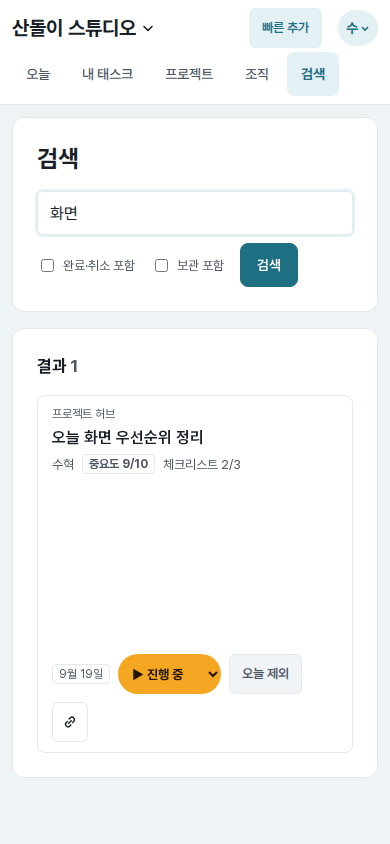
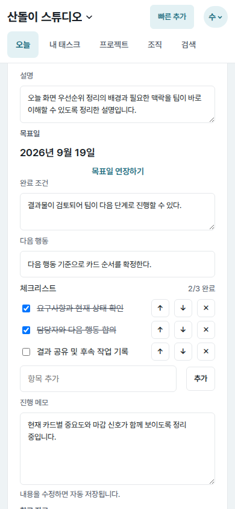
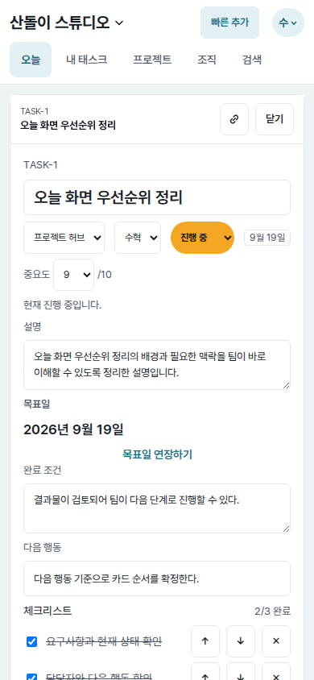
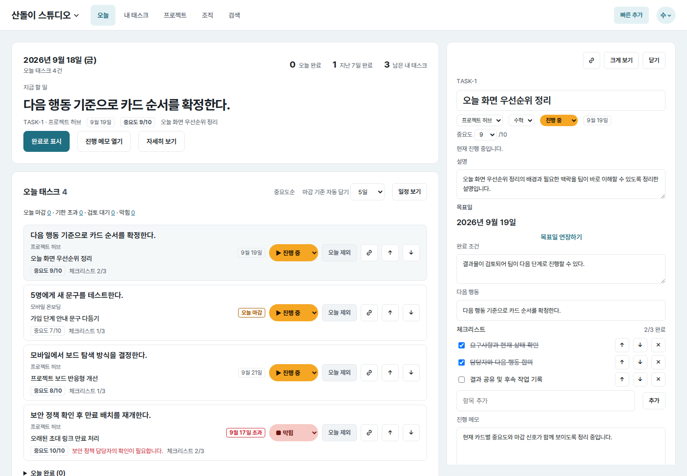
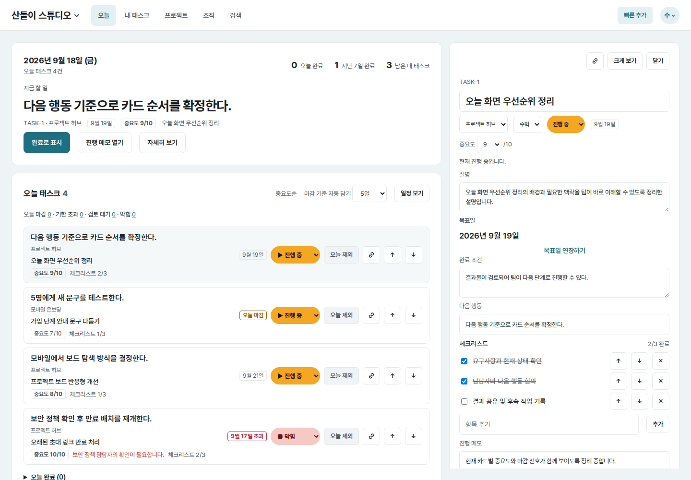

# UI evidence 01 — task cards and detail panel

## Why this changed

The independent Astra screenshot review found two shared-surface problems:

- At `390×844`, a search-result task card inherited the desktop main column's
  `240px` flex basis as vertical height, leaving roughly `180px` of empty space
  between its metadata and actions.
- Opening a task on mobile preserved the list's previous scroll position, so the
  detail could begin around the description while the task identity and close
  action were outside the viewport.

## Before and after

| Surface | Before | After |
| --- | --- | --- |
| Mobile search result (`390×844`) |  |  |
| Mobile task detail on initial open (`390×844`) |  |  |
| Desktop task detail (`1440×1000`) |  |  |

## Implementation decisions

- Reset the shared task row's flex basis only in the mobile column layout so
  search, today, project, and personal-task lists all use content height.
- Preserve the source list's scroll position for close, but move a newly opened
  mobile detail to its beginning.
- Keep task number, title, and close action in a sticky mobile detail bar. The
  desktop side panel retains its existing structure.
- Increase inline metadata and checklist controls to consistent touch targets.
- Allow `Escape` to close a non-full-page task panel.

## Verification

- `web/tests.py`: `114 passed`
- `node --check core/web/static/app.js`
- Desktop task-detail document width: `1440px` at a `1440px` viewport
- Screenshots were captured from the same seeded local dataset before and after
  the change.
