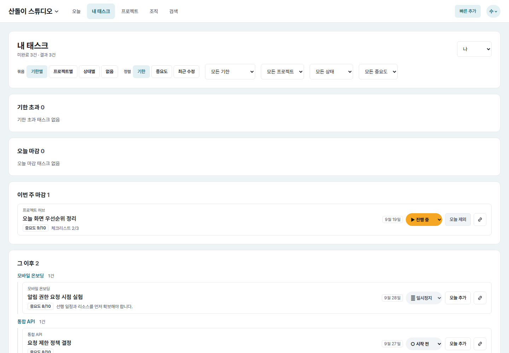
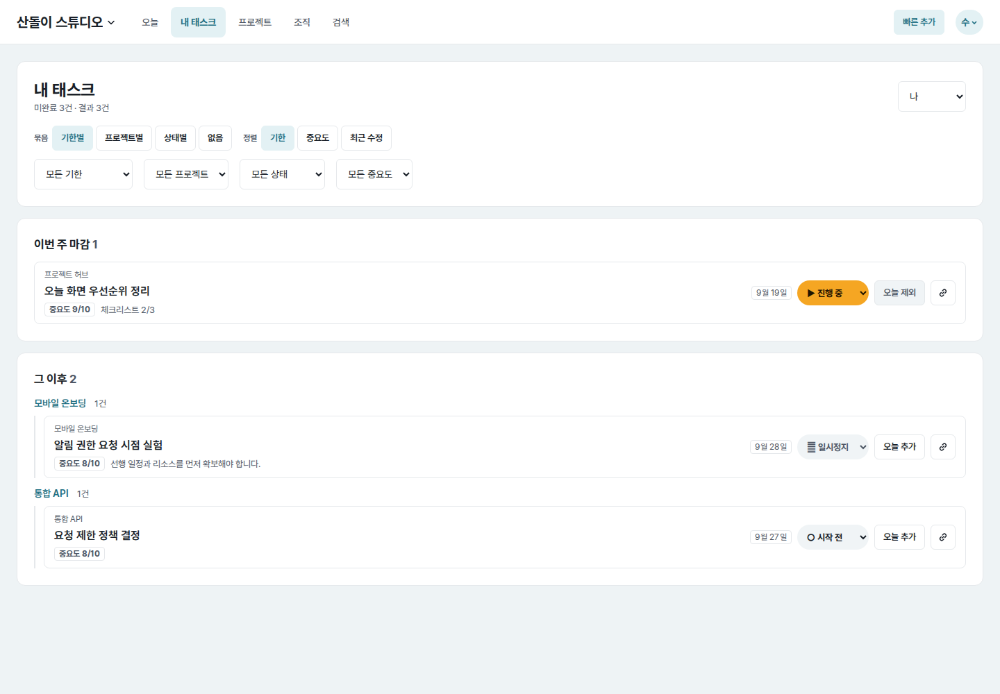

# UI evidence 02 — task filtering and empty groups

## Why this changed

The independent Astra baseline review found that the default personal-task page
used most of a `390×844` viewport for four advanced selects and two empty due
groups. No actual task was visible in the first viewport.

## Before and after

| Viewport | Before | After |
| --- | --- | --- |
| Mobile (`390×844`) |  |  |
| Desktop (`1440×1000`) |  |  |

All screenshots use `/me`, the same seeded account, and the same data.

## Implementation decisions

- Keep grouping and sorting visible because they change the primary list shape.
- Collapse due/project/status/priority controls behind a labelled native
  disclosure on mobile; keep them visible on desktop.
- Open the mobile disclosure when a filter is active so current state is never
  hidden, and preserve the user's mobile disclosure choice across viewport
  changes.
- Omit empty due groups. A single “결과 없음” state remains when no group has
  tasks.
- Retain query parameters and automatic form submission behavior.

## Measured result

- Mobile first task top: below `844px` before, `456px` after.
- Mobile advanced filter default: closed; desktop advanced filters: visible.
- Page width: `390px` at a `390px` viewport and `1440px` at a `1440px` viewport.

## Independent review and verification

- First pre-commit Astra High review: `CHANGES_REQUESTED` for a Sunday boundary
  test; UI and form behavior otherwise accepted.
- Added an explicit `2026-09-20` Sunday regression test: the empty “이번 주
  마감” group is omitted and its two boundary tasks stay in “오늘 마감”.
- Fresh post-fix Astra High review: `APPROVE`, with no commit-blocking issues.
- `tasks/tests.py` + `web/tests.py`: `194 passed` after the review fix.
- `node --check web/static/app.js` and `git diff --check`: passed.
