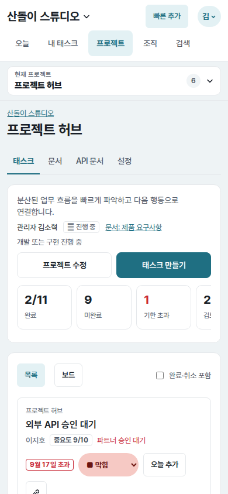
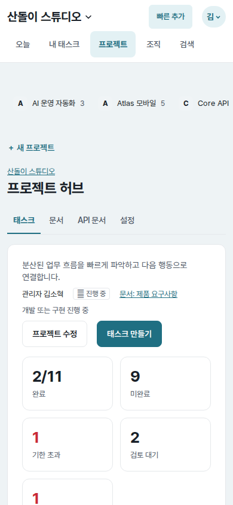
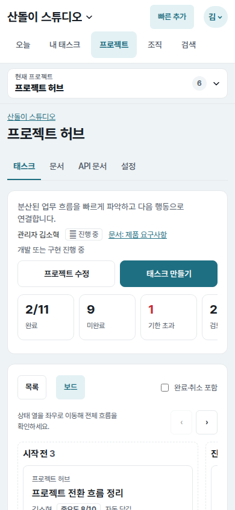
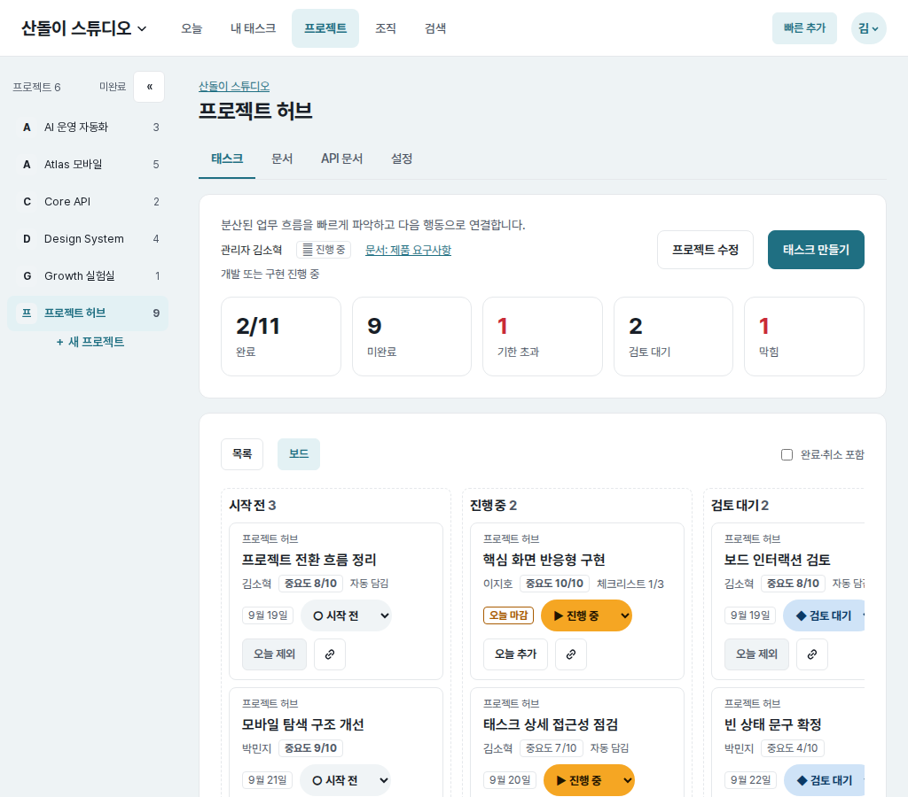
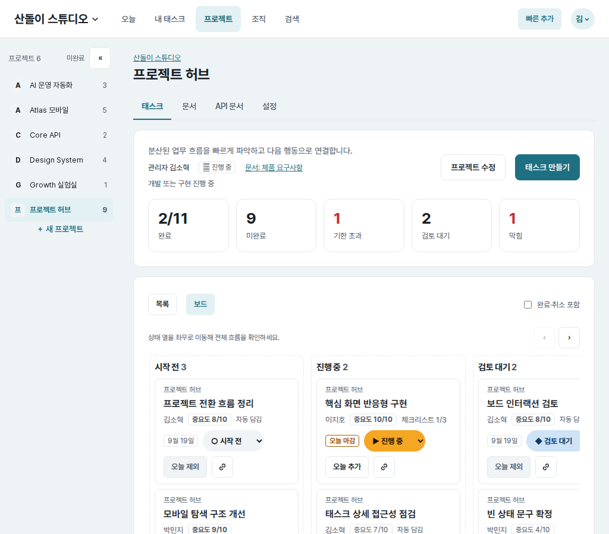
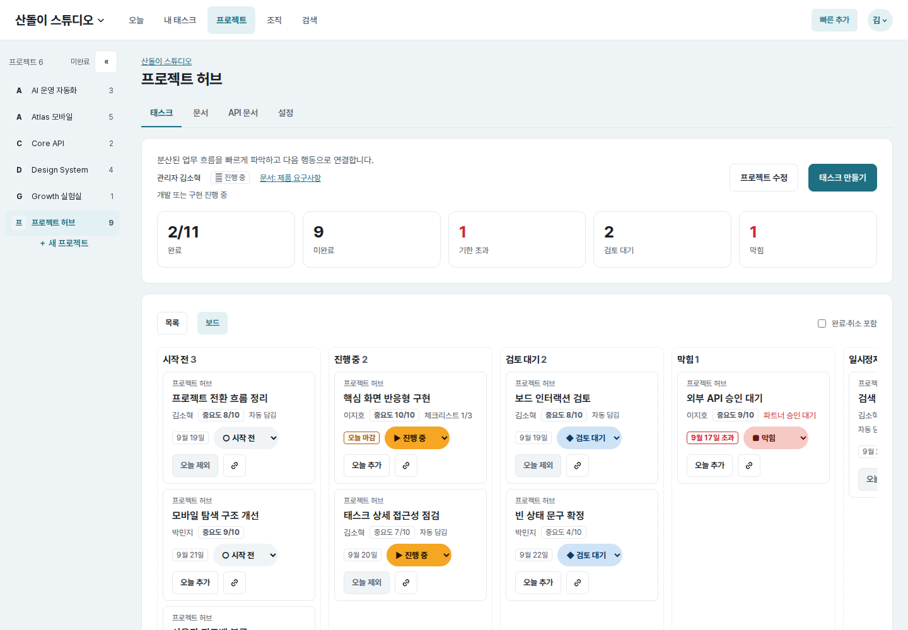
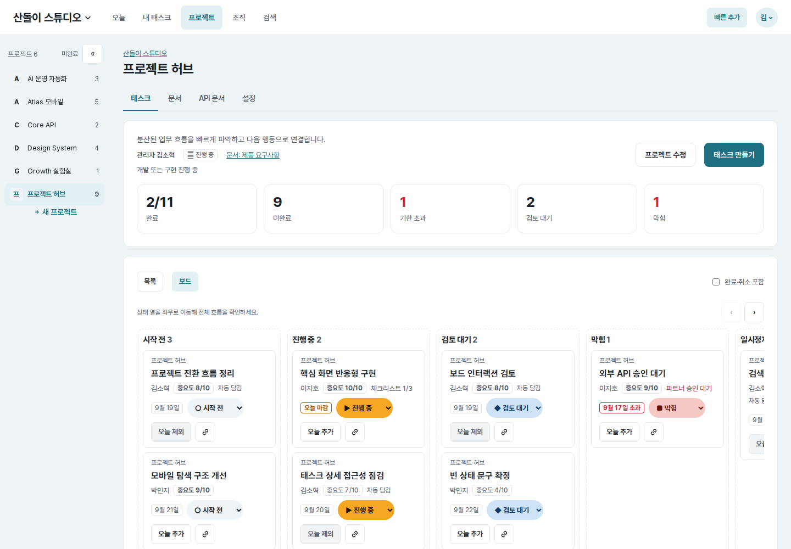
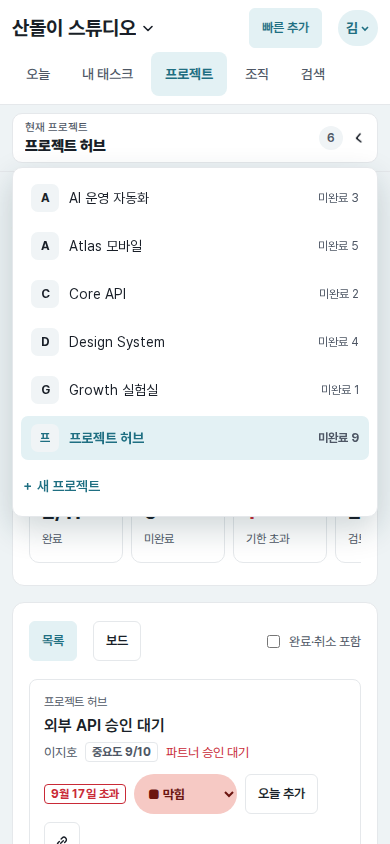

# UI evidence 03 — project navigation and board movement

## Why this changed

The independent Astra baseline review found that the project area lost both
location and content on narrow screens:

- At `390×844`, the desktop project rail wrapped to `160px` tall while showing
  only its first two projects. The selected “프로젝트 허브” was not visible.
- The five KPI cards wrapped into three rows, pushing the task surface to
  `y=931` and the board itself to `y=1016`, outside the first viewport.
- The board overflowed horizontally at every tested width without an explicit
  cue, button, or focusable scroll region for reaching later status columns.

## Before and after

| Surface | Before | After |
| --- | --- | --- |
| Mobile project list (`390×844`) |  |  |
| Mobile board (`390×844`) |  |  |
| Tablet board (`1024×900`) |  |  |
| Desktop board (`1440×1000`) |  |  |

The mobile picker's open state is captured separately in
. All captures use the
same seeded account, project, tasks, route, and viewport within each pair.

## Implementation decisions

- Preserve the information-dense desktop rail, but replace it at `700px` and
  below with a compact native disclosure that always names the current project.
  Its menu shows every project, its open-task count, the selected state, and the
  existing create action.
- Keep all five KPIs available while moving them into one compact, horizontally
  scrollable row on mobile. A partially visible next tile provides a visual cue,
  and the labelled region accepts keyboard focus and arrow-key scrolling.
- Keep native board scrolling and drag-and-drop behavior, while putting columns
  in a labelled, keyboard-focusable region with visible previous/next buttons.
- Scroll exactly one rendered column per button press, respect reduced-motion
  preference, disable controls at their respective edges, and resynchronise
  them after an HTMX board replacement.
- Show one near-full column plus a visible sliver of the next column on mobile;
  the reserved space also includes the column gap. Use scroll snapping only at
  that narrow breakpoint.

## Measured result

- Mobile project navigation height: `160px` before, `67px` after.
- Mobile task surface top: `y=931` before, `y=602` after.
- Mobile board top: `y=1016` before, `y=679` after.
- Mobile next-button movement: `312px` for one rendered column plus its gap.
- Page width stayed equal to the viewport at `320`, `390`, `700`, `701`,
  `1024`, and `1440px`; no document-level horizontal overflow was introduced.
- At both scroll extremes, the unavailable board direction is disabled. The
  same state and one-column movement were reverified after an HTMX board swap.

## Verification

- `web/tests.py`: `117 passed`
- `tasks/tests.py` + `web/tests.py`: `196 passed`
- `node --check core/web/static/app.js`
- Django system check and `git diff --check`: passed.
- Browser interaction checks covered the project picker, keyboard KPI scrolling,
  board controls, endpoint states, HTMX replacement, task-panel open/return at
  `390/1024px`, and `320/700/701px` responsive boundaries.
