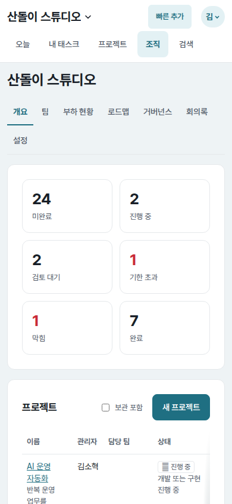
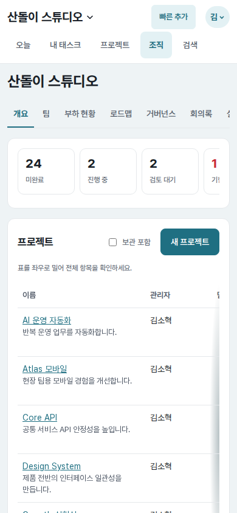
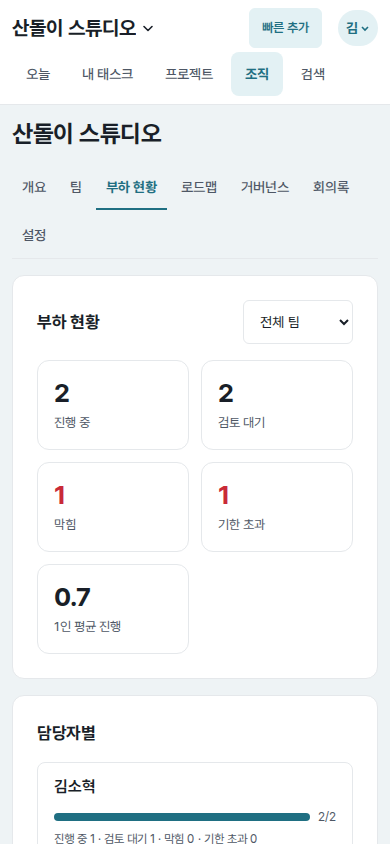
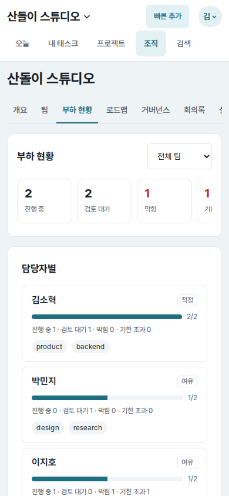
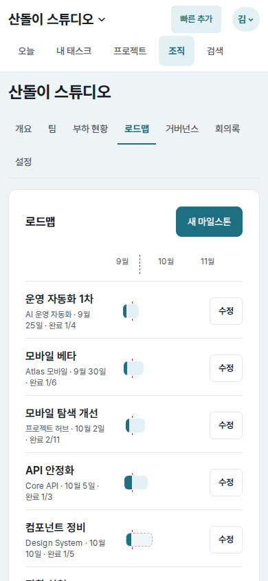
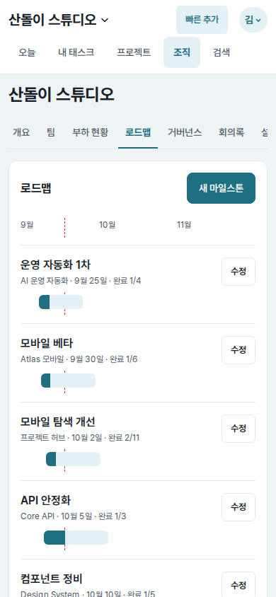
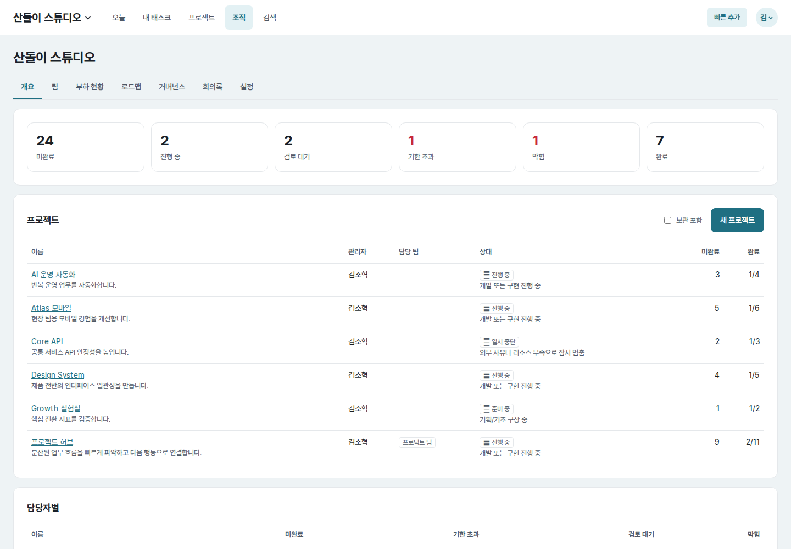
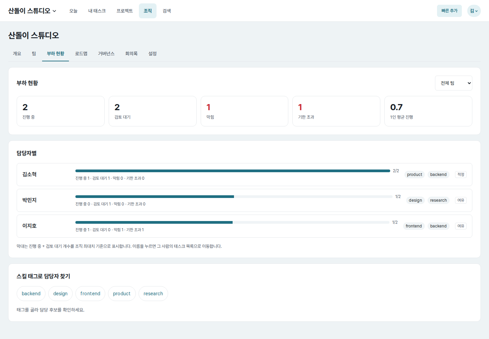
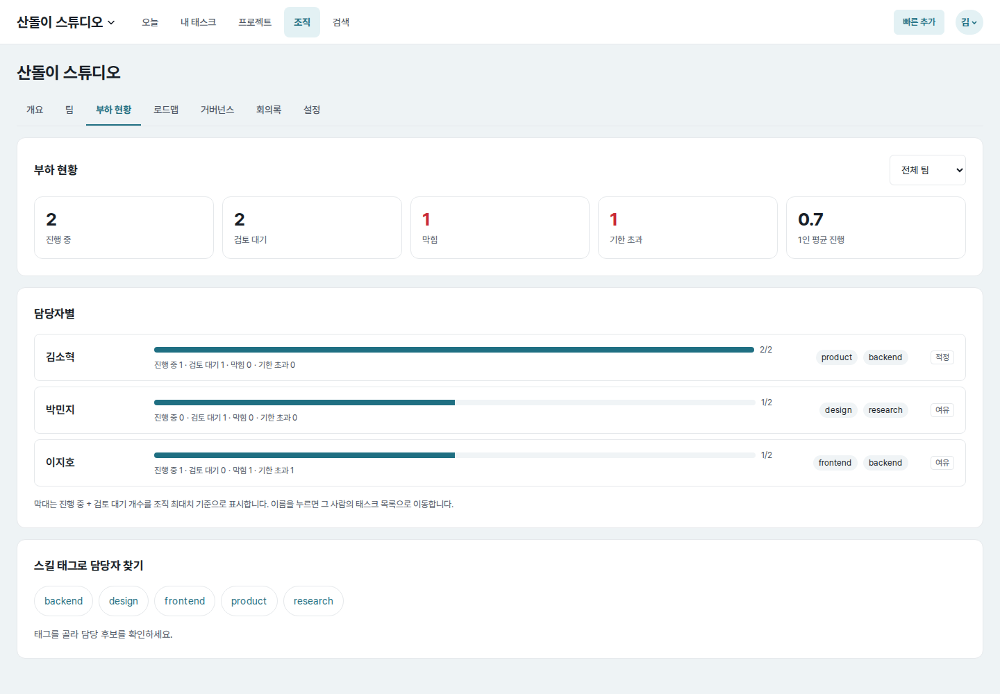
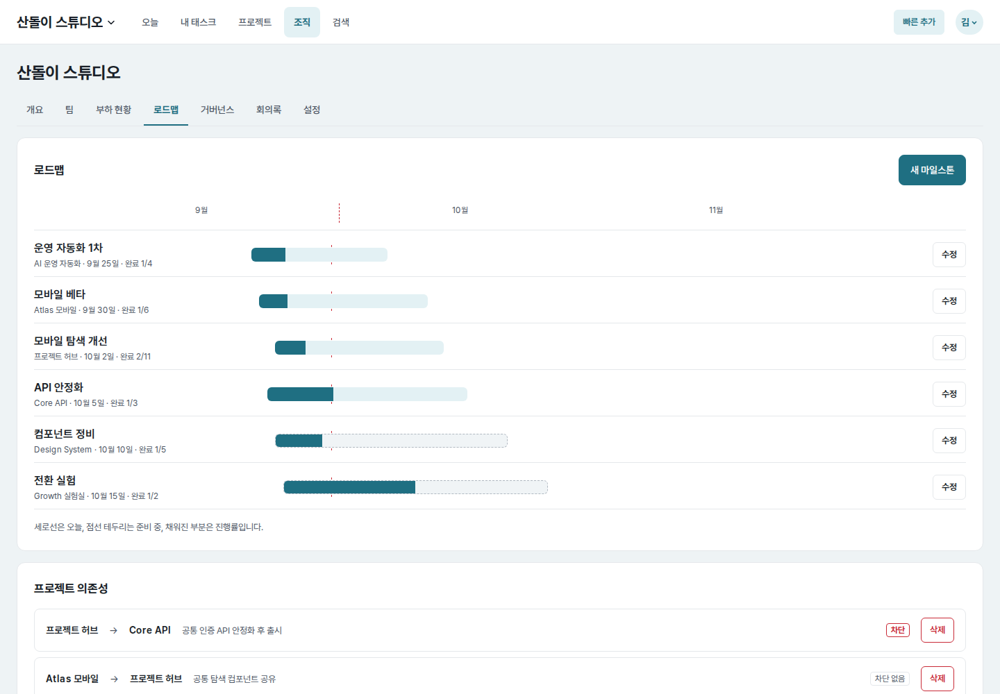

# UI evidence 04 — organization overview, capacity, and roadmap

## Why this changed

The independent Astra baseline review found that organization information lost
its structure on mobile:

- Seven organization tabs wrapped to a `93px` two-line block, leaving “설정”
  isolated on the second line.
- Overview and capacity metrics used three tile rows, pushing the project table
  and first member row to `y=720` and `y=762` at `390×844`.
- The project table compressed its first cell to `85px`, making a single row
  `118px` tall while later count columns remained off-screen without a cue.
- Roadmap names, the timeline, and edit action competed on one line, leaving
  only `124px` for the actual time scale.

## Before and after

| Surface | Before | After |
| --- | --- | --- |
| Mobile organization overview (`390×844`) |  |  |
| Mobile capacity (`390×844`) |  |  |
| Mobile roadmap (`390×844`) |  |  |
| Desktop organization overview (`1440×1000`) |  |  |
| Desktop capacity (`1440×1000`) |  |  |
| Desktop roadmap (`1440×1000`) |  |  |

All pairs use the same seeded organization, members, projects, tasks,
milestones, route, and viewport.

## Implementation decisions

- Keep organization tabs on one horizontally scrollable line at `700px` and
  below. On every organization route, the current tab is moved into view without
  changing the desktop tab row.
- Put overview and capacity KPIs in one labelled, focusable row on mobile. A
  partially visible next metric acts as the visual overflow cue; keyboard arrow
  scrolling and a visible focus outline remain available.
- Preserve the project and assignee tables as comparison tables rather than
  duplicating them as cards. Give each a labelled focusable scroll region, an
  explicit mobile hint, a readable minimum width, edge shadows, and a sticky
  identity column so project or person context remains visible while scrolling.
- Lay capacity rows out on named grid areas. Desktop members now share aligned
  name, meter, tag, and verdict columns; mobile cards put the verdict beside the
  name and give the meter and tags full width.
- On mobile, place each milestone identity and edit action above a full-width
  timeline track. The month header uses that same width, so bars remain
  comparable.

## Measured result

- Mobile organization tab height: `93px` before, `45px` after. The last “설정”
  tab is automatically visible on its own route.
- Mobile project table top: `y=720` before, `y=466` after.
- First project cell: `85×118px` before, `210×80px` after.
- Mobile first capacity row top: `y=762` before, `y=486` after.
- Mobile roadmap track width: `124px` before, `332px` after.
- Table and KPI keyboard checks moved their scroll positions by `40px` and
  `102px`, with a visible `2px` focus outline.
- Page width matched the viewport at `320`, `390`, `700`, `701`, and `1440px`.
  The project identity column stayed fixed to the scroll-region edge at both
  `320` and `700px`.
- Desktop overview-table and roadmap-track dimensions were unchanged. Capacity
  meter widths changed from a content-dependent `949–958px` range to the same
  `890px` for every member, with shared tag and verdict positions.

## Verification

- `web/tests.py`: `120 passed`
- `tasks/tests.py` + `web/tests.py`: `199 passed`
- `node --check core/web/static/app.js`
- Django system check and `git diff --check`: passed.
- Browser interaction checks covered first and last organization tabs, KPI and
  table keyboard scrolling, sticky identity cells, and `320/700/701px`
  responsive boundaries across overview, capacity, roadmap, and settings.
- Adversarial checks covered unbroken long project, purpose, assignee, and tag
  strings, plus a no-reload resize from `700px` to `320px` on the Settings tab.
