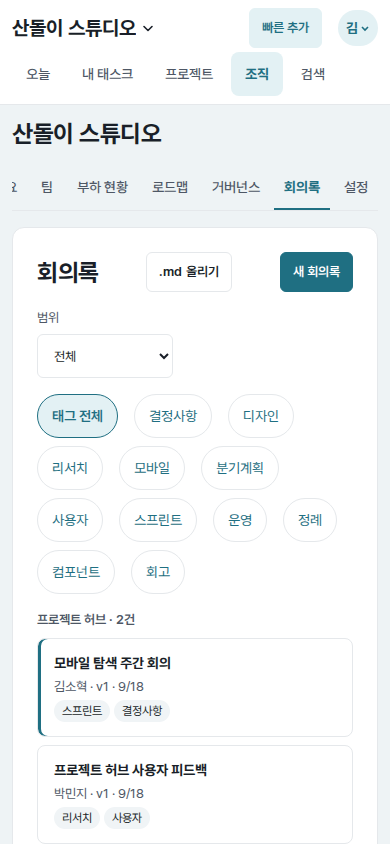
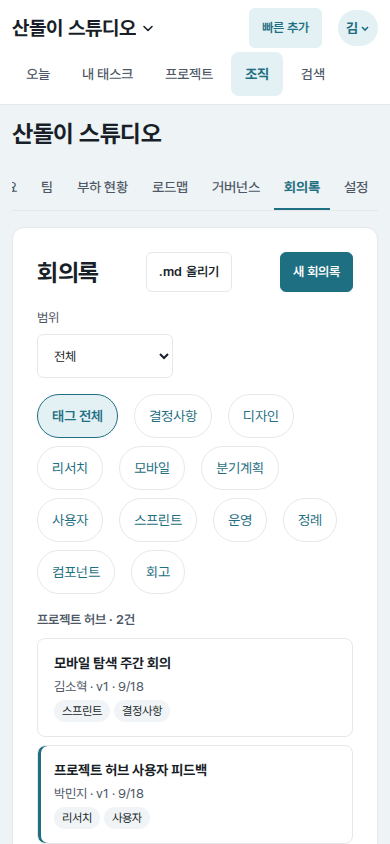
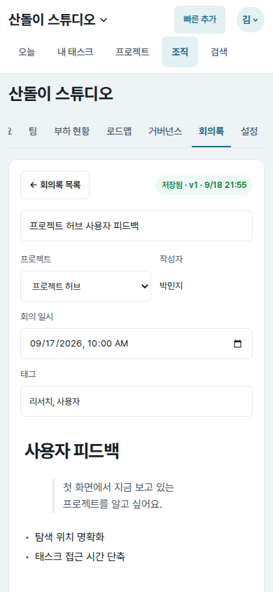
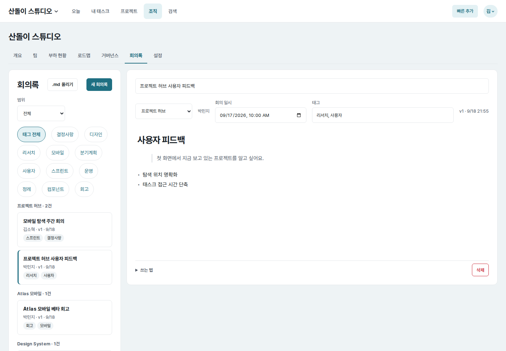
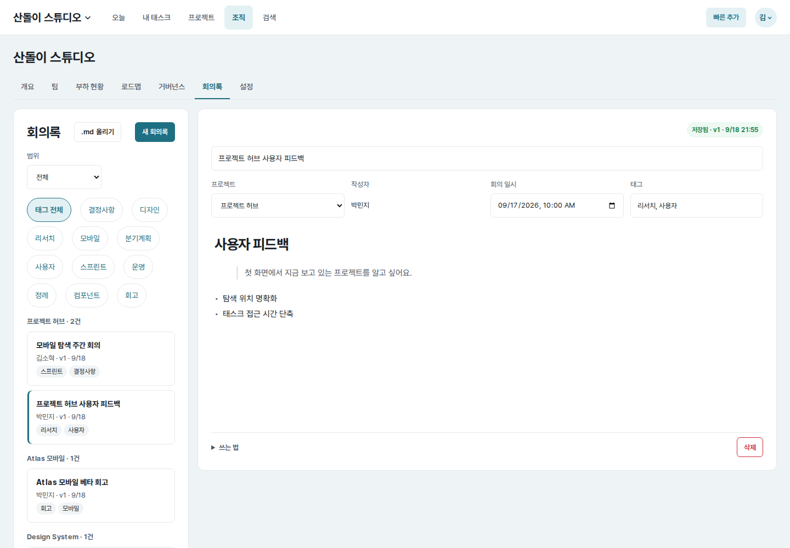
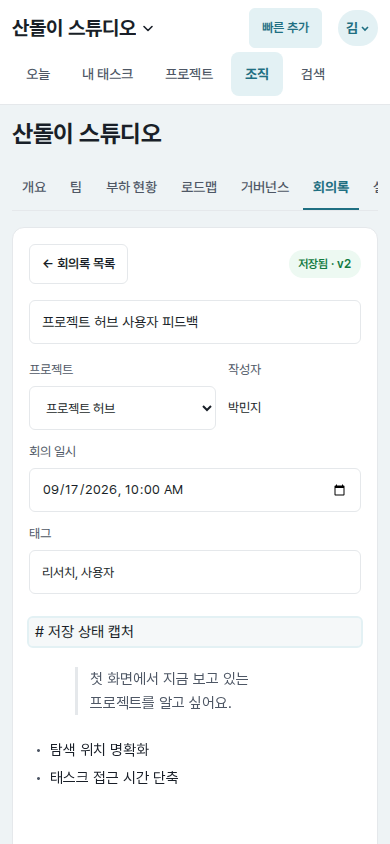
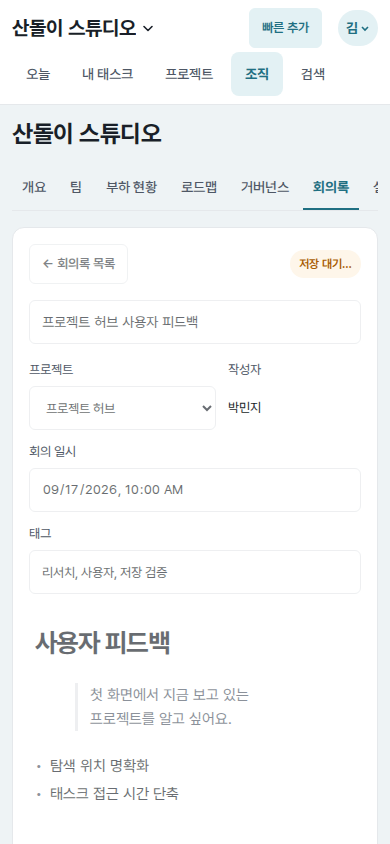

# UI evidence 05 — mobile meeting-note flow and save status

## Why this changed

The independent Astra baseline review found that selecting a meeting note on a
narrow screen did not reveal its content. At `390×844`, the selected-note route
still began with a `1,251px` list card; the editor started at `y=1494`, far below
the viewport. The only save feedback was a small version/date string mixed into
the metadata row.

## Before and after

| Surface | Before | After |
| --- | --- | --- |
| Mobile note list (`390×844`) |  |  |
| Mobile selected note (`390×844`) |  |  |
| Desktop selected note (`1440×1000`) |  |  |

The save lifecycle is shown in
,
 and
. The paired screenshots use
the same seeded organization, notes, selected note, route, and viewport.

shows the temporarily locked editor before navigation.

## Implementation decisions

- Distinguish an explicitly requested note from the default first note in the
  server context. At `850px` and below, the default route shows only the list;
  a valid `note` query shows only the editor. This works without JavaScript.
- Add a visible “회의록 목록” return action that preserves the active scope and
  tag filter. Selecting a note and returning both use normal URLs and browser
  history.
- Keep the existing side-by-side list and editor at `851px` and above, where the
  two minimum column widths actually fit.
- Move save feedback into a persistent editor toolbar. Initial, pending,
  successful, conflict, and failed requests now expose explicit state text and
  color while retaining the polite live region.
- Keep a field-keyed save outbox and send it serially, so each request uses the
  version returned by the previous one. Failed metadata stays in the outbox and
  is retried before unrelated later changes. The list-return action first
  flushes the latest body snapshot and any edits made during an in-flight save;
  it navigates only after the outbox is clean, and remains in the editor when a
  request fails.
- Freeze title, metadata, and body editing while a return-triggered flush is in
  progress. The editor exposes `aria-busy`; a failure restores every control,
  while a focused metadata value is blurred into the outbox before freezing.
- Replace the wrapping metadata row with labelled project, author, meeting-time,
  and tag fields. Date and tag inputs take the full editor width on narrow
  screens; desktop keeps a compact four-column grid.

## Measured result

- Mobile selected-note editor top: `y=1494` before, `y=227` after.
- Mobile selected-route document height: `2203px` before, `1064px` after.
- Mobile date and tag inputs: both `332px` wide at `390px`; neither is clipped.
- List → selected note: editor visible, list hidden, `scrollY=0`.
- Editor → list: list visible, editor hidden, scope preserved in the URL.
- Save lifecycle: `저장 대기…` (`pending`) → `저장 중…` (`saving`) →
  `저장됨 · v2` (`saved`).
- Immediate return issued one save request and navigated only after it completed.
  Editing again during an outstanding request issued two serialized requests
  and preserved the newest body; an injected `500` response kept the editor
  open, restored the return action, and showed the error state.
- A failed title followed by a tag edit produced `title v1 failed → title v1
  retry → tags v2`, then reported `saved v3`. The unload guard stayed active
  after failure and throughout a return-triggered save, and cleared only after
  every pending value was acknowledged.
- During return, every metadata control was disabled and the document was inert.
  An injected failure restored them; a focused, unblurred title was submitted
  before navigation instead of being discarded.
- A 50-character unbroken author name at `320px` stacked below the project
  selector; both fields stayed `262px` wide and document width stayed `320px`.
- Single-surface behavior remains active at `320`, `700`, `701`, and `850px`;
  the two-column desktop layout resumes at `851px` and remains at `1024/1440px`.
- Document width matched every tested viewport. The status treatment also used
  the configured dark-theme success colors without overflow.

## Verification

- `tasks/tests.py` + `web/tests.py`: `200 passed`
- Meeting-note focused web tests: `10 passed`
- `node --check core/web/static/notes.js` and `node --check core/web/static/app.js`
- Django system check and `git diff --check`: passed.
- Browser checks covered selection, explicit return, saving/saved transitions,
  an immediate return, edits during an outstanding save, a failed save, long
  metadata, failure followed by an unrelated successful edit, unload protection,
  dark theme, and the `320/700/701/850/851/1024/1440px` responsive boundaries.
