# UI evidence 06 — Today scope, density, and schedule feedback

## Why this changed

The independent Astra baseline review found that the Today screen mixed two
different concepts without explaining them: the curated Today list can contain
manually selected work, while its due/status figures count tasks assigned to the
signed-in user across every accessible organization. On mobile, opening the
schedule also appeared to do nothing because the calendar began below all 11
task cards (`y=3201` at `390×844`).

The same review found an unreadable combined calendar state: when today was
also selected, the selected background replaced the teal fill but retained the
white text. HTMX list refreshes then forgot the open-schedule state and left the
visible calendar stale.

## Before and after

| Surface | Before | After |
| --- | --- | --- |
| Desktop Today (`1440×1000`) | 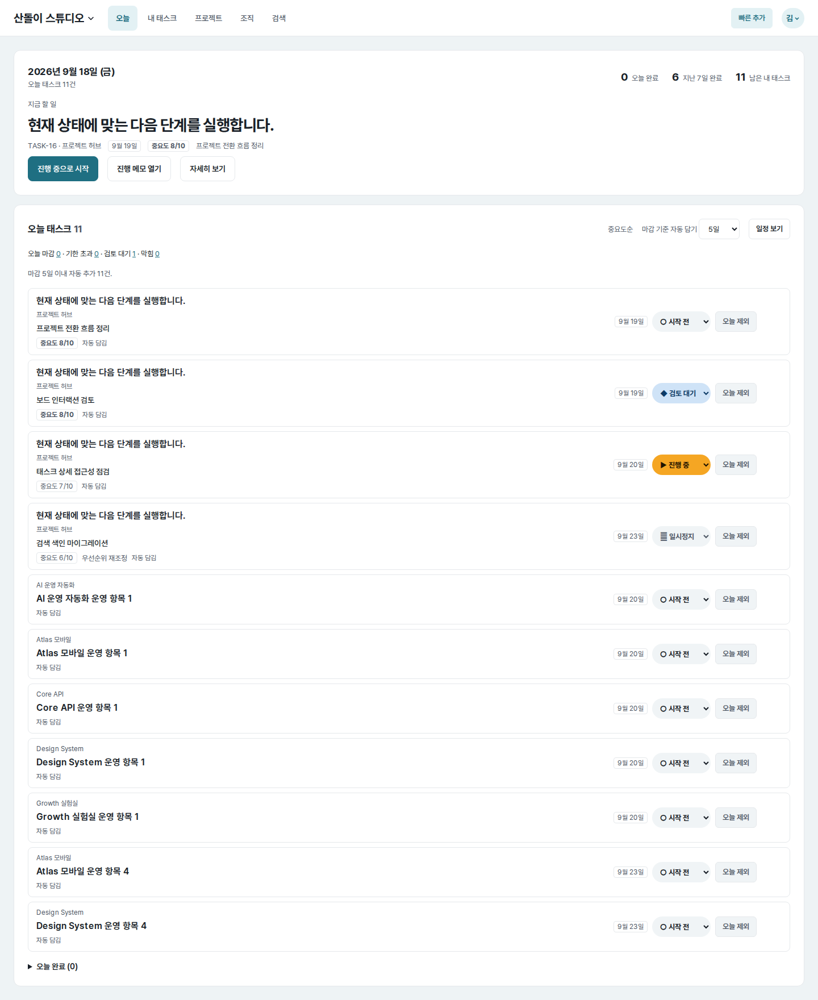 | 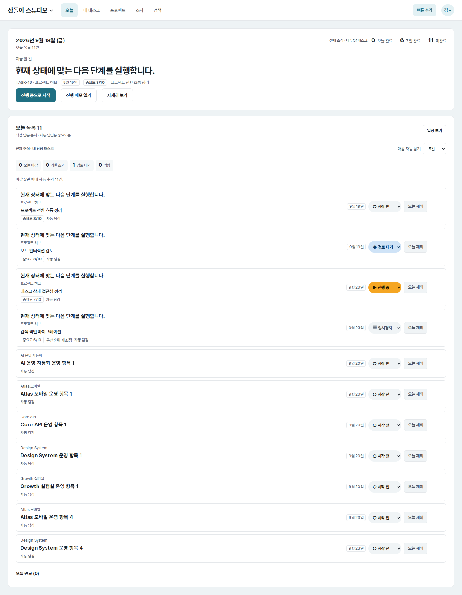 |
| Mobile Today (`390×844`) | 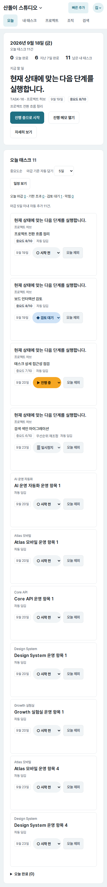 | 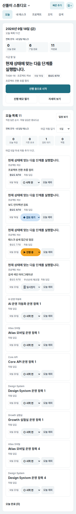 |
| Mobile schedule, full page (`390×844`) | 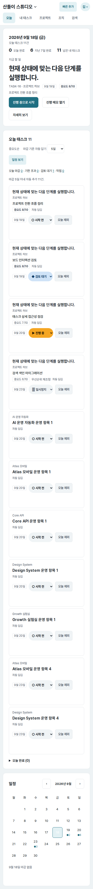 | 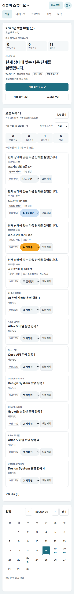 |
| Feedback immediately after “일정 보기” (`390×844`) | 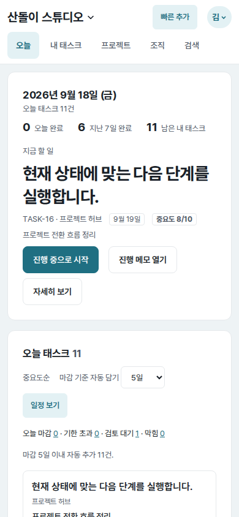 | 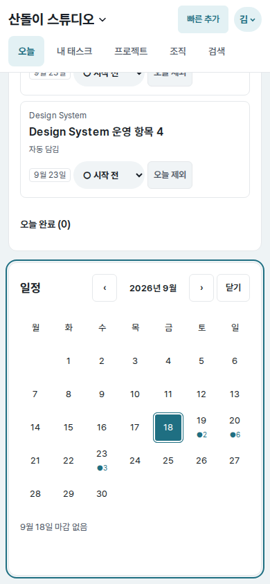 |
| Return after closing (`320×844`) | 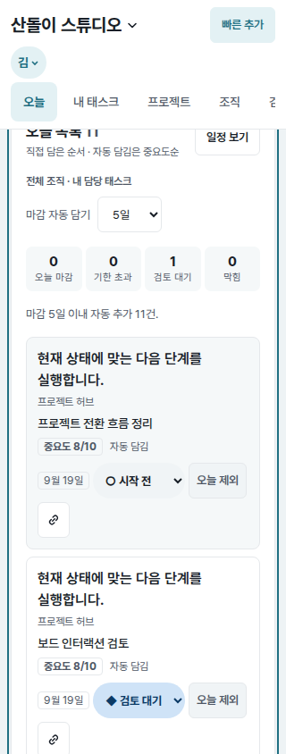 | 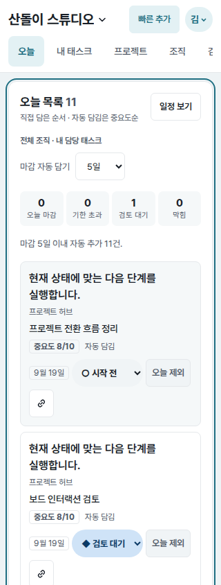 |

All pairs use the same seeded account, organizations, projects, tasks, date,
route, color scheme, and viewport. Full-page pairs are labelled separately from
the final viewport-only interaction pair. The supplemental
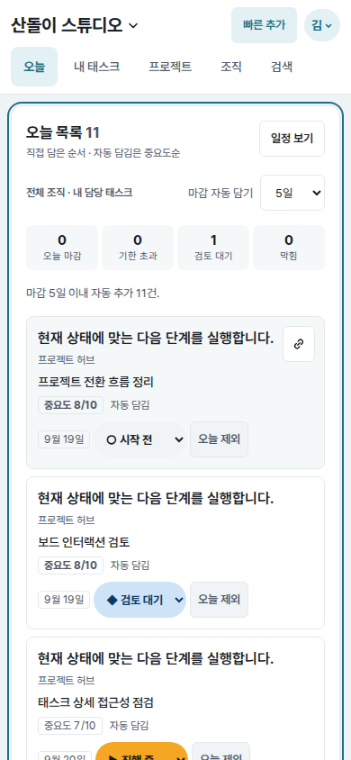
records the return destination below the sticky mobile header.

## Implementation decisions

- Keep the Today list's existing manual-first and automatic-importance ordering,
  but explain it as “직접 담은 순서 · 자동 담김은 중요도순.” The list is now
  named “오늘 목록,” while every assignment-based metric is labelled “전체 조직
  · 내 담당 태스크.” No ranking, membership, or visibility rule changed.
- Turn the mobile metrics into three stable summary cells and four compact
  status links. This keeps each destination explicit and raises the top metric
  link height from `26px` to `51px` without globally shrinking type.
- Give the current focus task a full-width primary action followed by two
  balanced secondary actions on narrow screens. Reduce only Today-card insets
  and spacing; shared task-row behavior on other screens is unchanged.
- Treat schedule opening as navigation, not a pressed button. The link exposes
  `aria-expanded`/`aria-controls`, changes to “일정 닫기” while open, and targets
  `#today-schedule`. Month and date links retain that anchor, and the calendar
  itself provides a nearby close action.
- Preserve `schedule`, `month`, and `day` through HTMX partial requests by
  encoding the originating state into the list, calendar, and row request URLs;
  `HX-Current-URL` remains a fallback. This also survives a task panel pushing
  `/tasks/:id` into the address bar. The schedule subscribes to the same task
  events as the header and list, so counts and selected-day tasks refresh
  instead of becoming stale.
- Expose today with `aria-current="date"`, include “선택됨” in the selected
  date's accessible name, and add an explicit combined today/selected visual
  rule with readable foreground color and an inset selection ring.
- Stack the Today list and calendar through `850px`. On fine pointers, the
  normally hidden copy control no longer reserves a wrapped action row; it
  remains available on hover and moves back into normal layout when keyboard
  focused. Touch layouts keep the visible control.
- Use a three-column mobile header grid for the organization, quick action, and
  account menu. At `320px`, this keeps all three on one row and lets the
  organization truncate deliberately instead of pushing the account menu onto
  a third header row.

## Measured result

- Clicking “일정 보기” at `390×844`: calendar top `y=3201`, `scrollY=0`, and
  not visible before; after, the URL targets `#today-schedule`, the section owns
  focus, `scrollY=2248`, and the complete `y=379–832` calendar fits in the
  viewport.
- Mobile document height: `3197px` before, `2623px` after. With the schedule
  open: `3682px` before, `3092px` after.
- At `320px`, the Today overview height fell from `480px` to `427px`; its three
  metric links are each `51px` high instead of `26px`. The page width remained
  exactly `320px`.
- A real browser flow retained August 2026 and the selected day while an
  auto-pull change refreshed both list and schedule. The toggle stayed expanded,
  exactly one calendar remained, and restoring the setting returned it to five
  days.
- With a task panel open at `/tasks/16`, a simulated `task-updated` event sent
  explicit August 12 state in both partial requests. Closing the panel restored
  the Today URL, August calendar, and expanded “일정 닫기” control together.
- Both the list's close toggle (keyboard) and the calendar's close action
  (pointer) returned focus to `#today-list` at `y=117`, below the `105px` sticky
  header, with the list heading and schedule control visible.
- At `320px`, the mobile header was `145px` before and placed the list at
  `y=117` underneath it. The grid keeps the header at `105px`; the focused list
  remains at `y=117`, its heading begins at `y=134`, and the organization name
  fits without overflow.
- The list/calendar layout is full width at `320`, `390`, `700`, and `850px`,
  resumes the desktop side-by-side layout at `851px`, and has no document-level
  horizontal overflow through `1440px`. The mobile navigation's intentional
  internal horizontal scroll remains available at `320px`.

## Verification

- `tasks/tests.py` + `web/tests.py`: `203 passed`.
- Today/schedule focused web tests: `12 passed`.
- Browser checks covered open/close navigation, month navigation, anchored
  focus, HTMX state retention, schedule refresh, combined selected/today state,
  and responsive layouts at `320/390/700/701/768/850/851/1440px`.
- Ruff lint, `node --check` for `app.js` and `notes.js`, Django system check,
  and `git diff --check`: passed.
