# UI evidence 07 — readable settings hierarchy and controls

## Why this changed

The independent Astra baseline review found that the three settings levels used
wide data tables as forms. At `390×844`, the organization table compressed its
item, value, and project-override columns to roughly `136/100/80px`; several
permission values showed little more than the select arrow. The 50-setting page
was `5457px` tall, its only save button was at the end, and native `13×13px`
checkboxes had no larger target or programmatic label.

Project settings also rendered a multiline Django `{# … #}` implementation
comment as visible text above the form. Scope copy incorrectly suggested one
blanket personal → project → organization precedence even though personal
preferences cannot relax organization task rules.

## Before and after

| Surface | Before | After |
| --- | --- | --- |
| Personal preferences (`1440×1000`) | 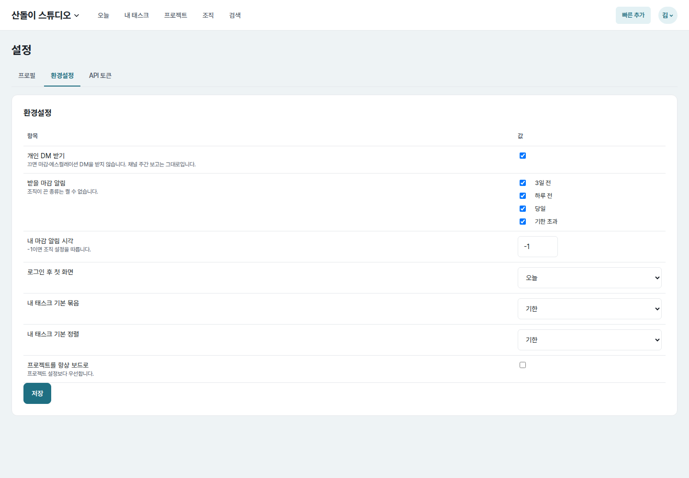 | 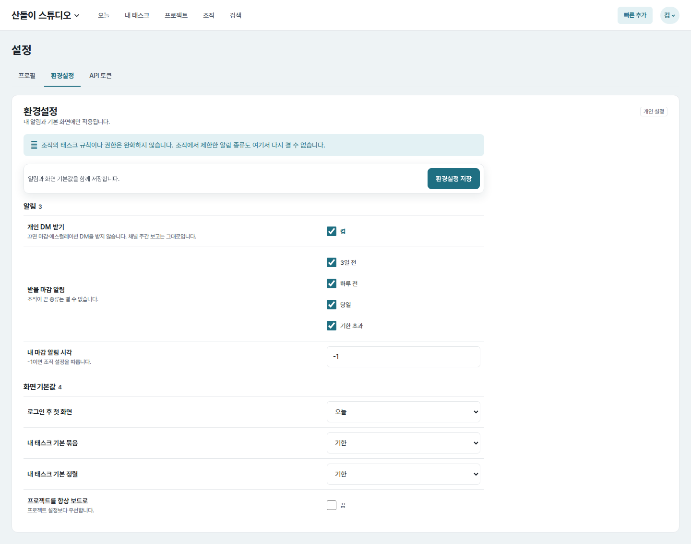 |
| Personal preferences (`390×844`) | 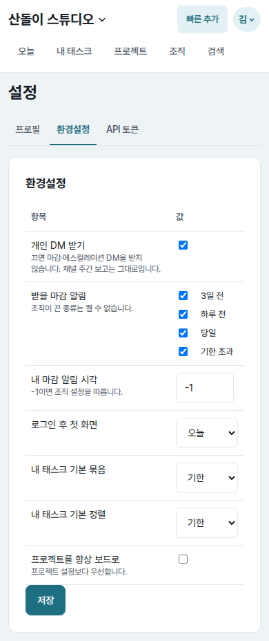 | 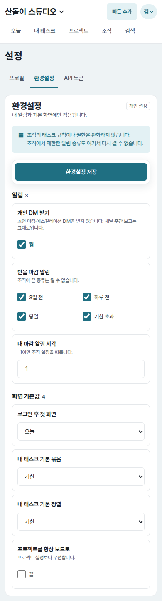 |
| Project settings (`1440×1000`) | 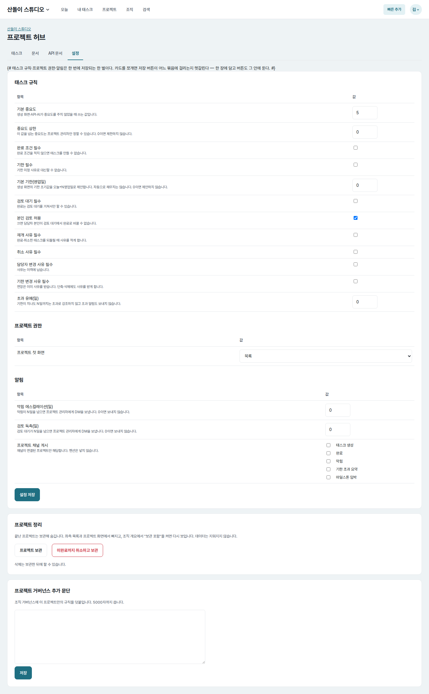 | 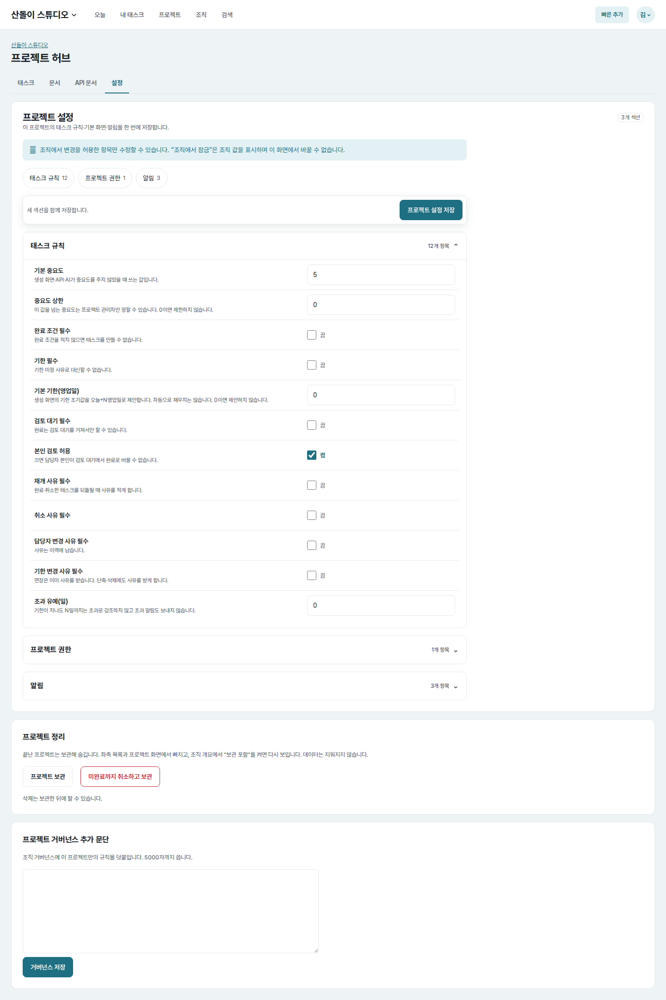 |
| Project settings (`390×844`) | 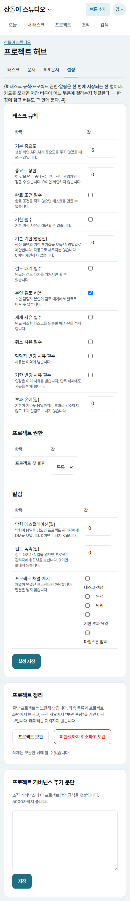 | 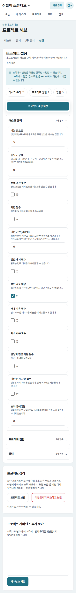 |
| Organization settings (`1440×1000`) | 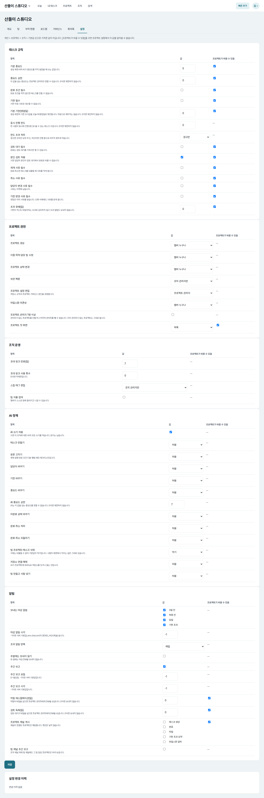 | 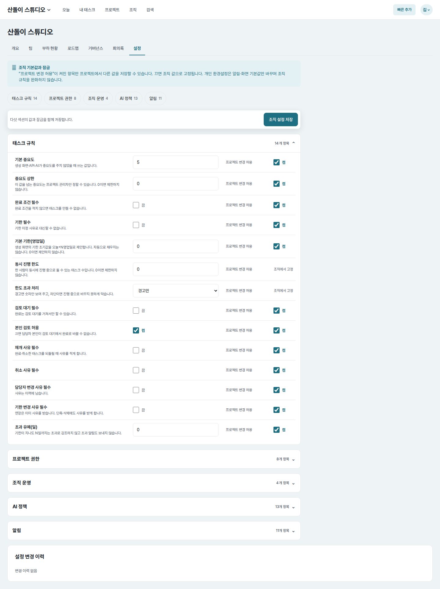 |
| Organization settings (`390×844`) | 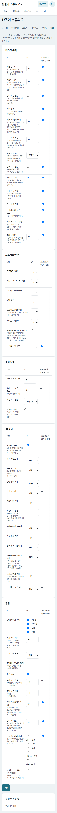 |  |

All pairs use the same seeded account, organization, project, effective values,
route, light color scheme, and viewport. The supplemental
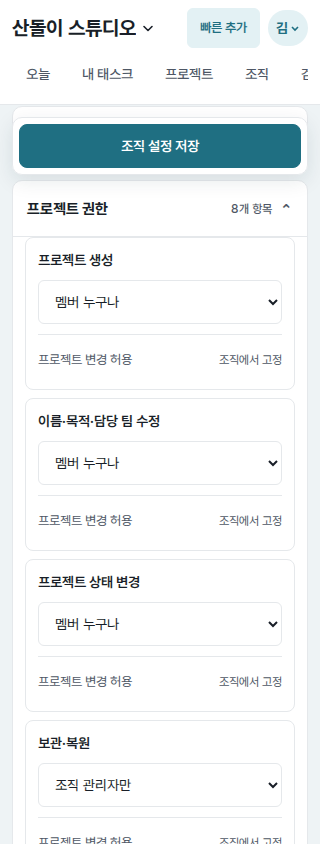 shows
the sticky shared save action and full-width long selected values after a section
jump.

## Implementation decisions

- Replace presentation tables with one shared settings-row component. Desktop
  uses bounded, aligned columns; at `850px` and below each label/help block,
  control, and organization override permission stacks in reading order.
- Associate every scalar control with its visible setting label and help text.
  Set-valued settings use labelled groups, and each option is a full clickable
  label. Boolean and override controls retain native checkboxes while adding an
  explicit “켬/끔” state and a `44px` label target.
- Separate personal notification choices from screen defaults and explain that
  these preferences do not loosen organization rules.
- Explain organization locks accurately: only settings marked “프로젝트 변경
  허용” can differ per project, and disabled permissions fix the organization
  value. Project locked rows remain read-only and link administrators back to
  organization settings. No inheritance control or persistence behavior was
  invented.
- Keep one POST for each main settings form. A sticky save region names its
  exact scope and remains inside that form; repository rules, archive actions,
  and governance keep their separate forms and now use explicit save labels.
- Add section chips and native disclosure groups for the long project and
  organization forms. The first section starts open; selecting a chip closes
  its siblings, opens the requested group, focuses its summary, and positions it
  below the sticky save region. Without JavaScript, the link still reaches the
  corresponding disclosure summary.
- Replace the leaking multiline template comment with a real Django comment.

## Measured result

- Controls missing an accessible label: `6` personal scalar controls, `15`
  project scalar controls, `48` organization scalar controls, and `16` override
  controls before; `0` after on all six rendered routes.
- Native checkbox box: `13×13px` before, `20×20px` after; enclosing clickable
  labels are at least `44px` high.
- Desktop settings content is bounded to `960px` instead of stretching every
  row across `1342px`. Personal select controls align at `320px` wide.
- At `390px`, the organization project-permission value column was about `65px`
  before. Controls are now stacked at `316px`; at `320px` they remain `244px`
  wide with document width exactly matching the viewport.
- Initial organization document height: `4349px → 1927px` desktop and
  `5457px → 3701px` mobile. Its five summaries retain visible item counts; only
  the active group is expanded.
- A section jump at `390px` places the focused summary at `y=180`, immediately
  below the sticky save region ending at `y=175`. It closes sibling groups and
  preserves unsaved control values when returning.
- The stacked layout has no document-level overflow at
  `320/390/700/701/768/850px`; aligned desktop columns resume at `851px` and
  remain bounded through `1440px`.
- When the separate project-archive card is brought into view, the project
  settings save region ends above it (`y=159` vs. archive top `y=192`) and does
  not cover its actions.

## Verification

- Full core test suite: `519 passed`.
- Settings-focused web tests: `12 passed`.
- Browser checks covered mouse and keyboard section navigation, sticky save
  positioning, sibling disclosure behavior, unsaved-value retention, external
  and wrapped checkbox labels, long selected permission values, and form/action
  overlap.
- Responsive browser checks covered `320/390/700/701/768/850/851/1024/1440px`.
- Ruff lint, JavaScript syntax, Django system check, and `git diff --check`:
  passed.
