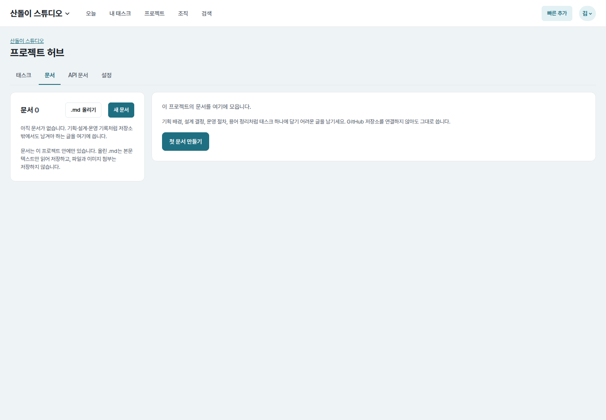
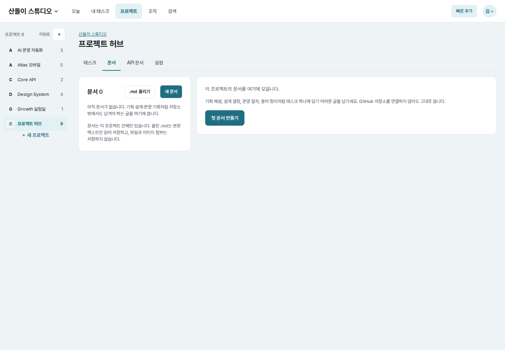
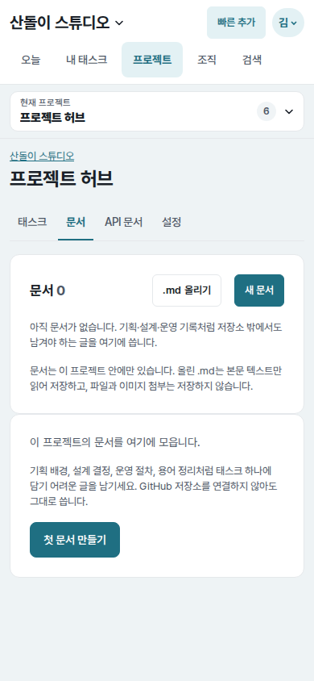
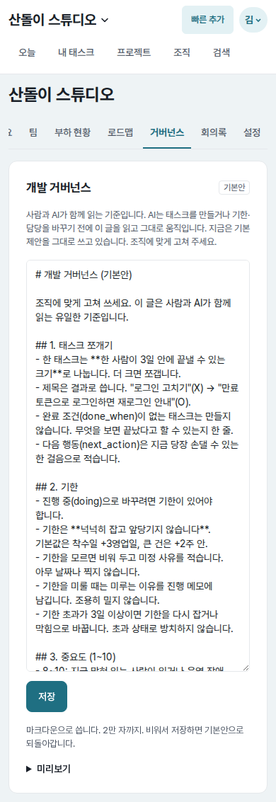
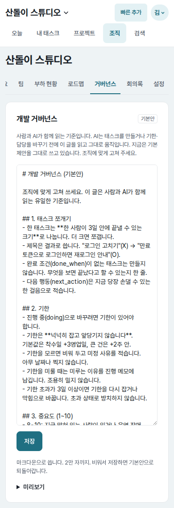
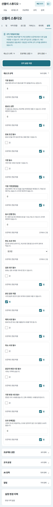

# UI evidence 08 — sibling-tab navigation continuity

## Why this changed

The final independent Astra sweep found that project Tasks and API tabs kept the
project shell, but Documents and Settings did not. Moving between sibling tabs
removed the desktop project rail, the mobile current-project picker, and the
active “프로젝트” item in the global navigation. Organization Governance and
Settings similarly lost the active “조직” state.

The views already supplied the current project/organization. Their route names
were simply absent from the shared shell navigation map.

## Before and after

| Surface | Before | After |
| --- | --- | --- |
| Project Documents (`1440×1000`) |  |  |
| Project Documents (`390×844`) |  |  |
| Project Settings (`390×844`) |  |  |
| Organization Governance (`390×844`) |  |  |
| Organization Settings (`390×844`) |  |  |

Every pair uses the same account, route, data, viewport, and color scheme.

## Implementation and measured result

- Add project Documents, Settings, and Issues routes to the project shell map;
  add organization Governance, Settings, Discord, and Issues routes to the
  organization map. Existing Task/API/Repository and organization routes are
  unchanged.
- Project Documents and Settings: global Projects `aria-current` absent before,
  `page` after. Project rail/picker were both absent before and both render after.
- Organization Governance and Settings: global Organization `aria-current`
  absent before, `page` after.
- Mobile document width remains exactly `390px`. The Settings page grows only
  by the intentional `67px` current-project picker (`3043px → 3110px`).
- Desktop Documents remains within the `1440px` viewport while its content joins
  the same rail/main layout as sibling project tabs.

## Verification

- Regression tests cover Documents/Settings project shell context and
  Governance/Settings organization active state.
- Browser checks covered all five paired scenarios and confirmed no horizontal
  overflow.
- Django system check, Ruff lint, and `git diff --check`: passed.
