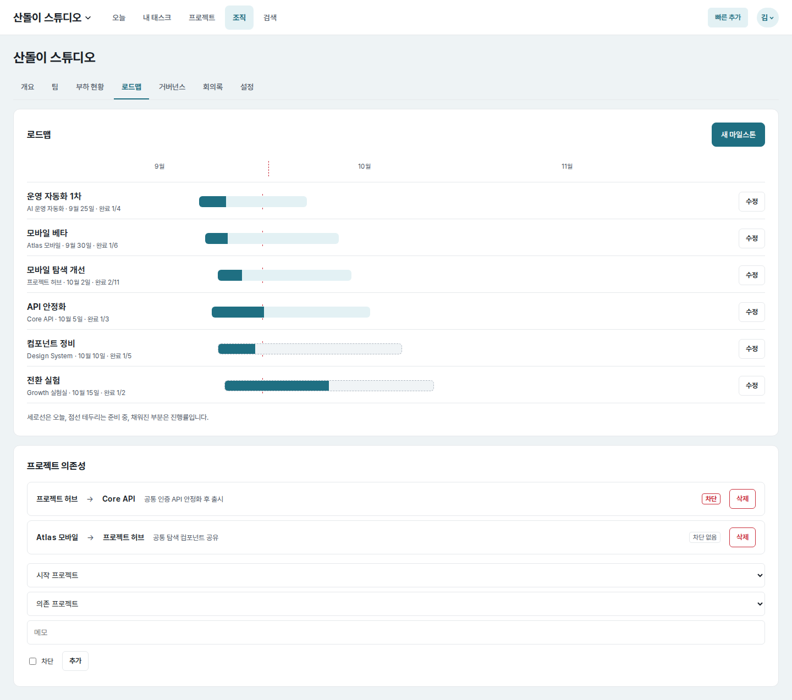
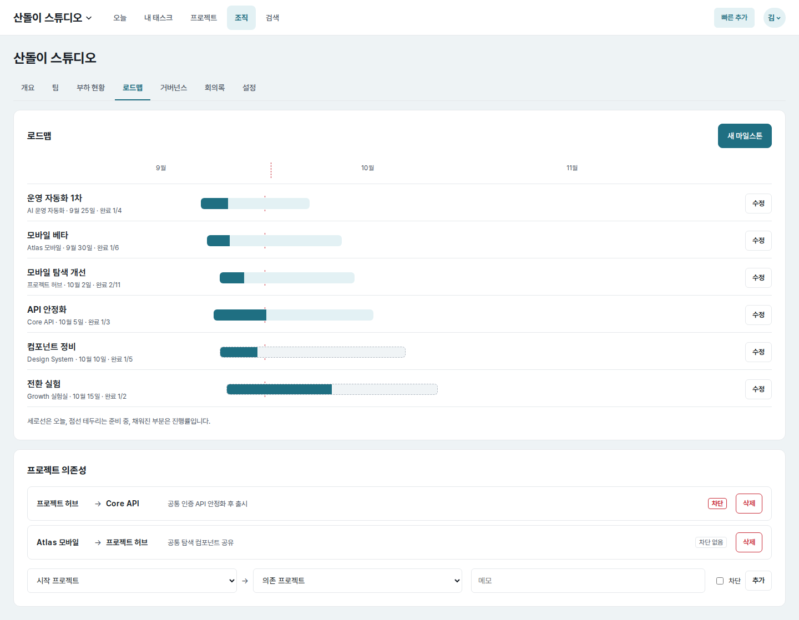
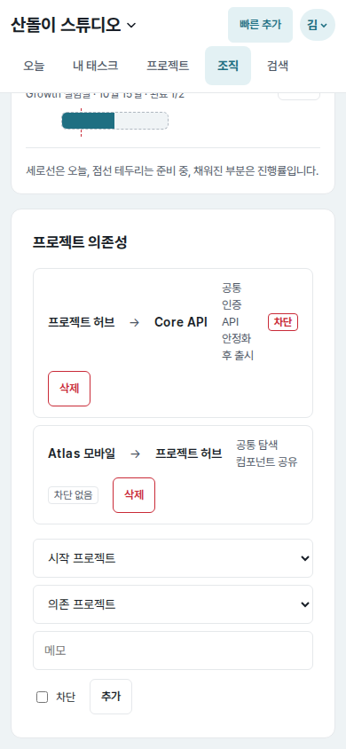

# UI evidence 10 — readable roadmap dependencies

## Why this changed

The independent Astra cross-surface audit found that the generic wrapping row
on the organization roadmap squeezed dependency notes into whatever horizontal
space remained between the project names, status, and delete action. At the
`390×844` mobile viewport, the first note rendered in a `36×95px` column and
the row grew to `169px`, making the relationship difficult to scan.

## Before and after

| Surface | Before | After |
| --- | --- | --- |
| Full roadmap (`1440×1000`) |  |  |
| Full roadmap (`390×844`) |  |  |
| Dependency viewport (`390×844`) |  |  |

Each pair uses the same route, account, fixture data, viewport, and light color
scheme. The detailed mobile pair records the dependency rows and creation form
in the actual page viewport; the full-page pair preserves their surrounding
roadmap context.

## Implementation and measured result

- Each saved dependency now has explicit relationship, note, status, and action
  regions instead of relying on a generic wrapping flex row.
- Mobile rows place the project relationship first, give the note the complete
  row width, and align status with the destructive action on a final row.
- The creation form groups its two projects as a visible
  `start → dependency` relationship and supplies explicit labels for all three
  fields. It stacks without horizontal overflow on narrow screens.
- The delete button has a relationship-specific accessible name, so repeated
  “삭제” actions remain distinguishable to assistive technology.
- At `390px`, the compressed first note changed from `36×95px` to `302×19px`;
  dependency rows are now a consistent `332×129px`.
- At `320px`, notes retain `232px` of width. Browser checks at
  `320`, `390`, `700`, `701`, and `1440px` all matched document width to
  viewport width with no horizontal overflow.

## Verification

- Roadmap rendering regression test: passed.
- Browser checks covered the saved rows, creation form, desktop/mobile
  breakpoint boundary, and page overflow.
- Ruff lint/format, Django system check, and `git diff --check`: passed.
