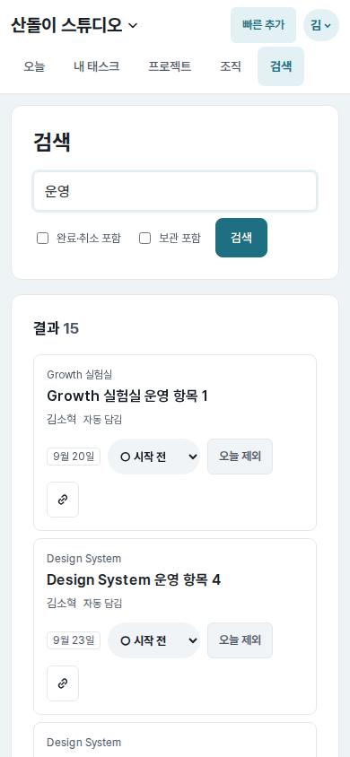
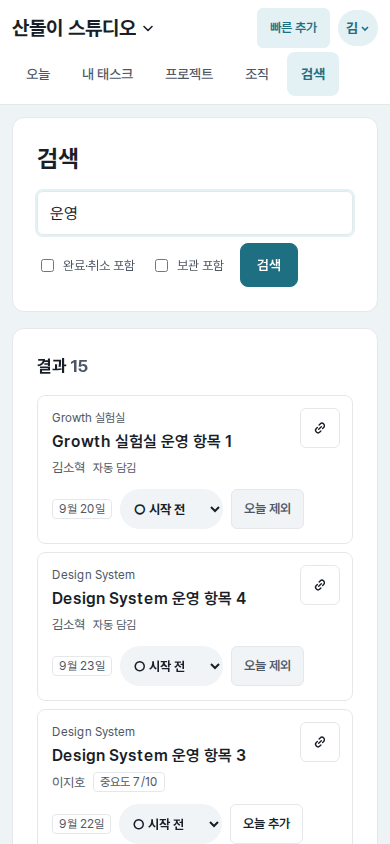
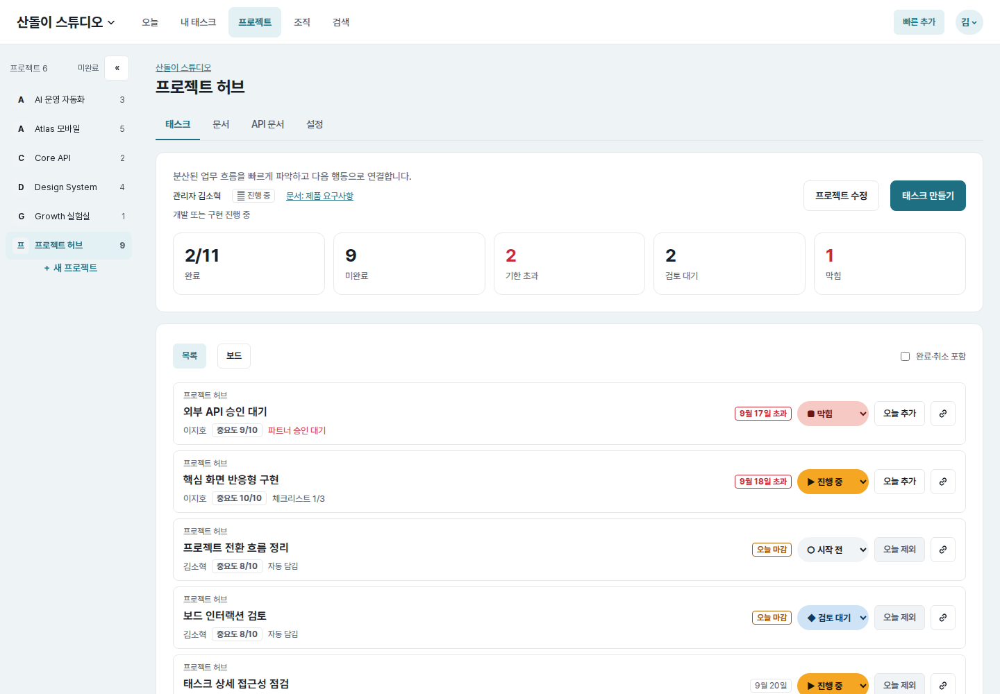

# UI evidence 11 — compact mobile task actions

## Why this changed

Task cards kept the shortcut-copy button in the wrapping action row on mobile.
At `390×844`, the button wrapped by itself after the due date, status, and Today
action on Search, My Tasks, project list, and project board surfaces. The action
area became `88px` high and each card carried an isolated second control row.

## Before and after

| Surface | Before | After |
| --- | --- | --- |
| Search (`390×844`) |  |  |
| My Tasks (`390×844`) |  |  |
| Project list (`390×844`) |  |  |
| Project board (`390×844`) |  |  |
| Today regression guard (`390×844`) |  |  |
| Project list (`1440×1000`) |  |  |

Each pair uses the same route, account, fixture data, viewport, and light color
scheme. Every baseline was rendered with the parent commit's exact stylesheet
against the same running page. Before writing each pair, the capture verified
identical first-four task IDs, titles, due labels, section headings, scroll
offset, and first-card Y position.

## Implementation and measured result

- Non-Today mobile task rows now treat shortcut copy as a top-right card utility
  instead of a wrapping member of the primary action row.
- The main text region reserves `48px` on the right, so the `40×40px` copy
  control never overlaps project, title, or metadata content.
- Touch/non-precision pointer layouts keep the copy action visible. Existing
  precision-pointer behavior still reveals it on row hover or keyboard focus.
- Today rows have an explicit class and retain their previously approved layout;
  their copy action already fit in one row and moving it would have forced the
  next-action title to wrap.
- At `390px`, action regions on all four affected surfaces changed from
  `88px` to `40px`. Card heights changed from `197→149px` on Search,
  `198→150px` on My Tasks, project list, and project board.
- Today remains `170px` high and the desktop project-list row remains `90px`
  high, confirming that the scoped rule does not regress those surfaces.
- Browser checks at `320`, `390`, `700`, `701`, and `1440px` found no document
  overflow or text/control overlap. At `320px`, primary actions can still wrap
  when needed, but copy no longer adds another row.

## Verification

- Shared task-row CSS regression test: passed.
- Full web test suite: passed.
- Browser checks covered Today, Search, My Tasks, project list, and project board
  across the responsive breakpoint, including direct keyboard focus on copy.
- Ruff lint/format, Django system check, JavaScript syntax check, and
  `git diff --check`: passed.
