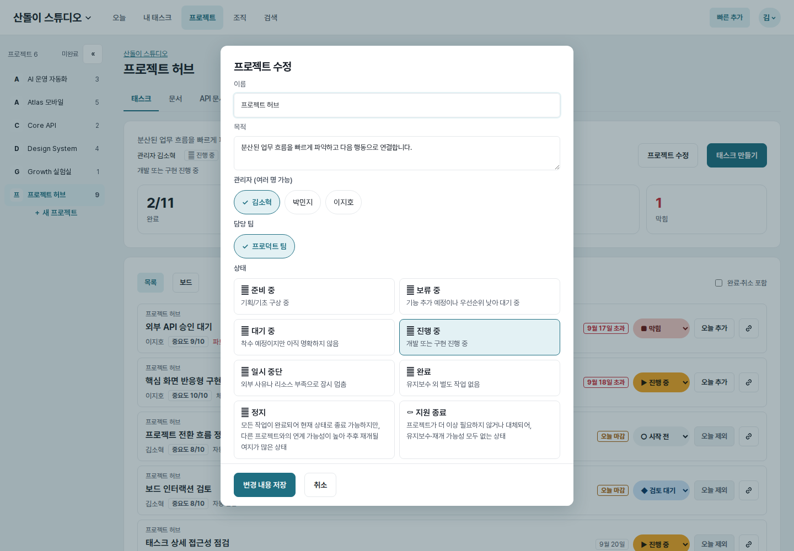
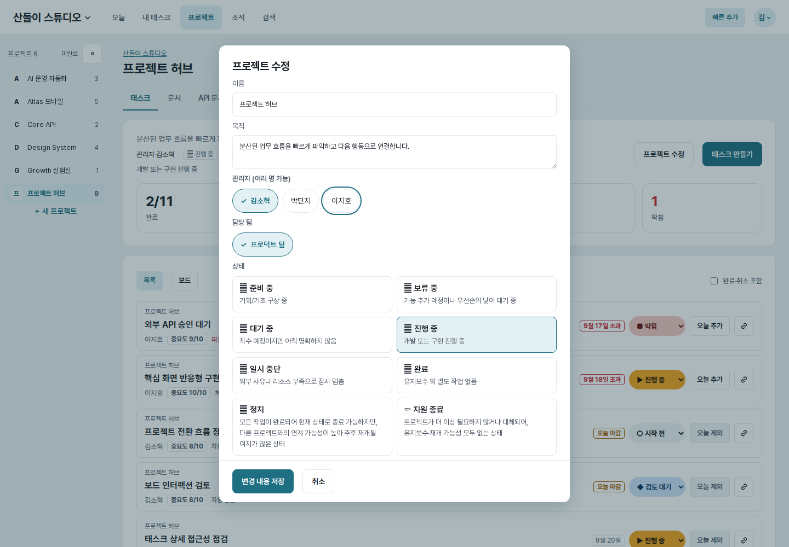
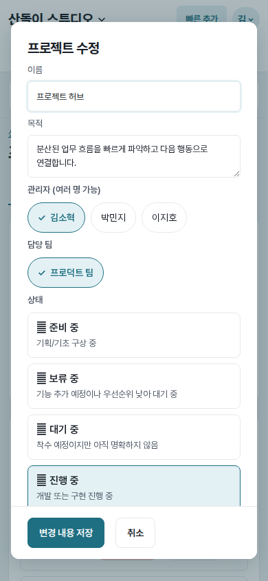
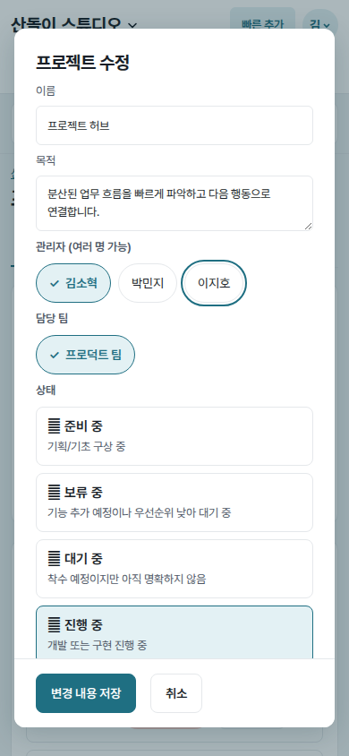
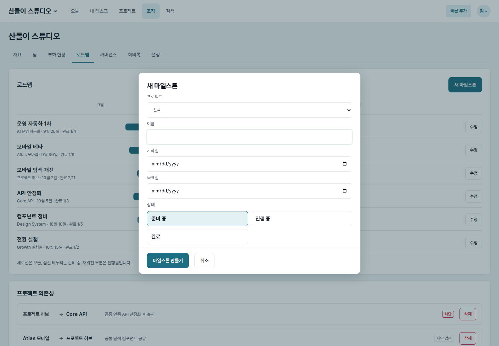
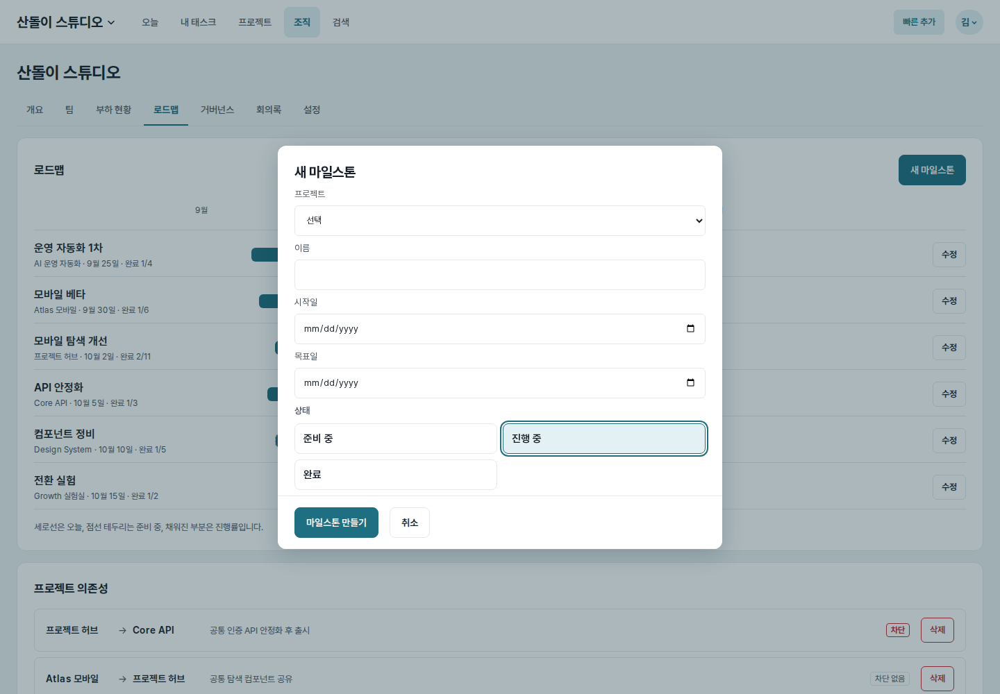
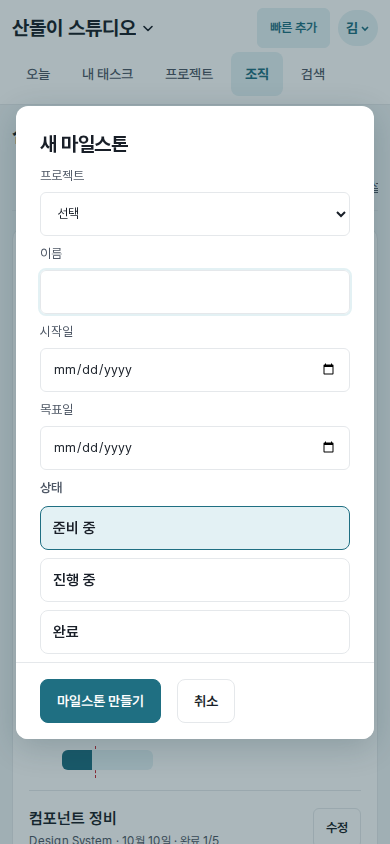
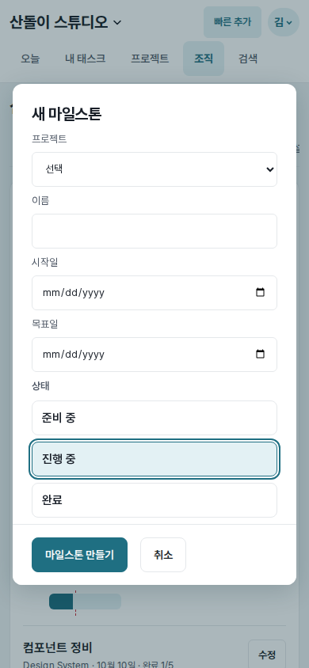

# UI evidence 12 — keyboard-accessible choice controls

## Why this changed

The final Astra audit found that project owner/team checkboxes and
project/milestone status radios used `display:none`. Their labels were clickable
with a pointer, but the native inputs were removed from both keyboard order and
the accessibility tree. There was no equivalent keyboard interaction.

## Before and after keyboard focus

| Control | Before | After |
| --- | --- | --- |
| Project owner (`1440×1000`) |  |  |
| Project owner (`390×844`) |  |  |
| Milestone status (`1440×1000`) |  |  |
| Milestone status (`390×844`) |  |  |

Each pair uses the same page, account, fixture data, viewport, and light color
scheme. The after images show focus reached through the real keyboard path; the
radio image is taken after moving from “준비 중” to “진행 중” with ArrowRight.

## Implementation and measured result

- Checkbox and radio inputs are visually clipped to `1×1px` instead of using
  `display:none`, preserving native names, roles, checked state, and keyboard
  behavior.
- `:has(input:focus-visible)` draws a `2px` primary outline around the complete
  chip or status card, so focus is visible on the same target users perceive.
- Project owners, project teams, project status, and milestone status are now
  grouped with `fieldset` and `legend` so assistive technology announces each
  choice in context.
- Before: input rectangle `0×0`, `display:none`, focus attempt left another
  element active, and no label outline. After: input rectangle `1×1`, native
  input active with `:focus-visible`, and the label outline is `solid 2px`.
- Project-owner checkboxes entered the Tab order and toggled with Space on both
  viewports. Milestone radios entered as one native group and ArrowRight changed
  the checked value from `planned` to `active` on both viewports.

## Verification

- Choice-control and existing project-dialog regression tests: passed.
- Browser checks covered Tab, Space, radio arrow navigation, focus visibility,
  desktop/mobile rendering, and unchanged pointer selection styling.
- Full web tests, Ruff lint/format, Django system check, JavaScript syntax, and
  `git diff --check`: passed.
