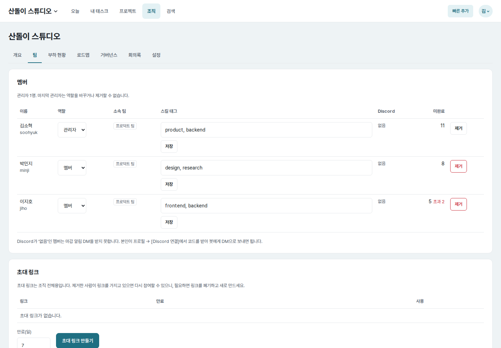
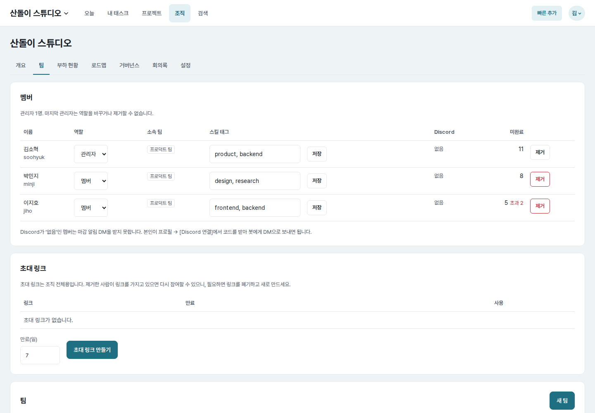
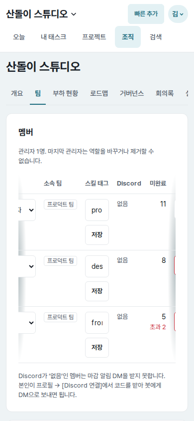
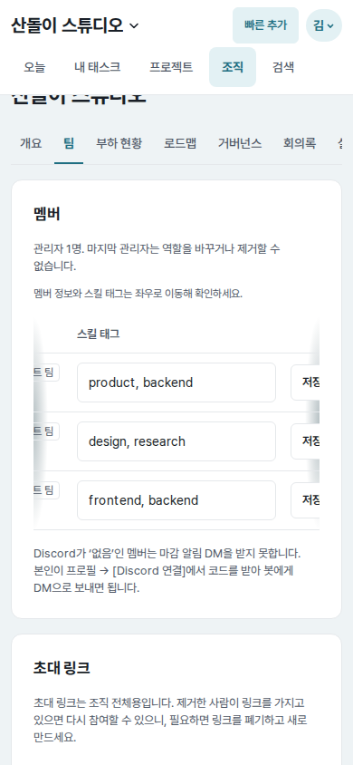

# UI evidence 13 — editable team skill tags on mobile

## Why this changed

The final Astra audit found that the organization member table compressed its
skill-tag inputs to about `48px` on mobile. A value such as
`product, backend` displayed only its first few characters, so existing skills
could not be reliably reviewed or edited. The inputs also had no associated
label to distinguish one member's field from another.

## Before and after

| Viewport | Before | After |
| --- | --- | --- |
| Desktop (`1440×1000`) |  |  |
| Mobile (`390×844`) |  |  |

Each pair uses the same route, account, fixture data, viewport, horizontal
member-table focus, and light color scheme. The screenshots center the first
member's `product, backend` input inside the table's own scroll region.

## Implementation and measured result

- The skill column now reserves `300px`; its non-wrapping form keeps the input
  between `200px` and `220px` while keeping Save beside it.
- A focusable, labelled wrapper is now the horizontal scroll container at every
  responsive boundary. Its mobile internal width is `760px`, while the document
  stays exactly `390px` wide with no page-level overflow.
- The mobile input changed from `48×44px` to `220×44px`, exposing the complete
  value. The desktop input uses the same focused editing width.
- Each input has a unique `id` and associated visually hidden label such as
  “김소혁 스킬 태그”. The measured label count changed from zero to one.

## Verification

- Skill-tag markup/CSS and existing save/normalization tests: passed.
- Browser checks covered `320`, `390`, `700`, `701`, and `1440px`, internal
  table scrolling, input visibility, associated labels, and page overflow.
- Full web tests, Ruff lint/format, Django system check, JavaScript syntax, and
  `git diff --check`: passed.
