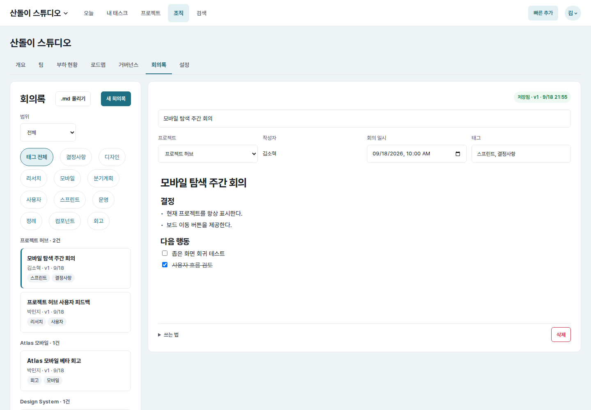
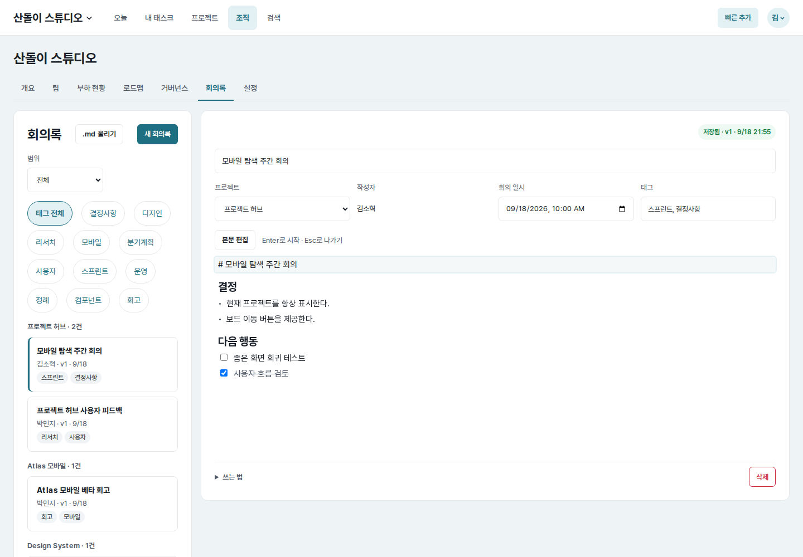
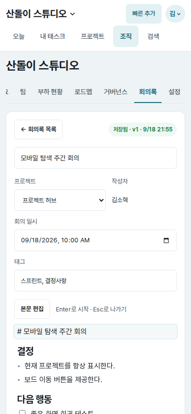
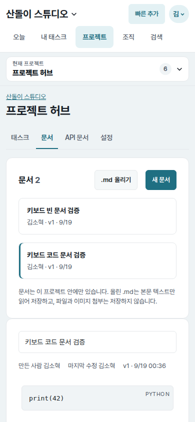
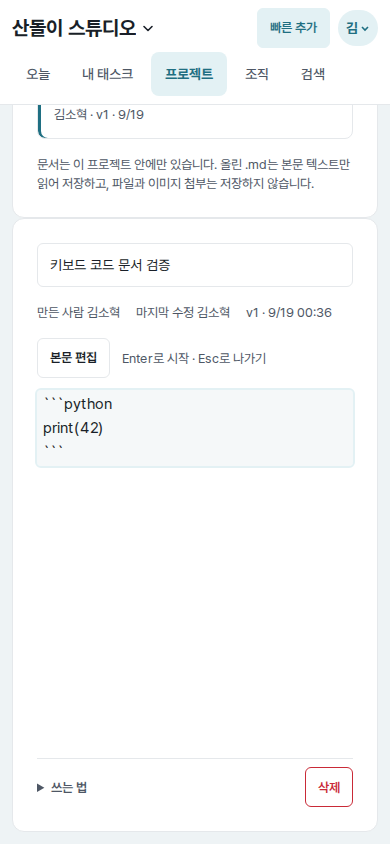
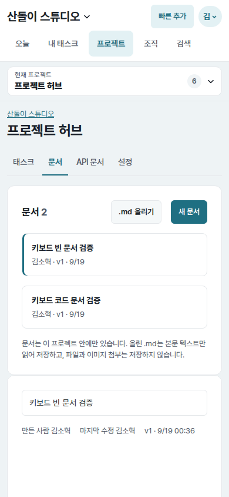
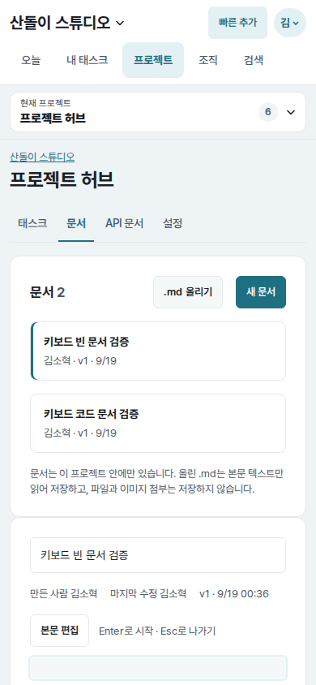

# UI evidence 14 — keyboard entry for document editing

## Why this changed

The final Astra completion audit found that meeting-note and project-document
bodies could only enter edit mode through pointer clicks. Their rendered blocks
were non-focusable `div` elements, while the source textarea and Save button
were hidden. Keyboard users could reach embedded checkboxes or links but could
not begin editing text, and Escape had no focusable return point.

## Before and after

| Document state | Before | After |
| --- | --- | --- |
| Populated meeting note (`1440×1000`) |  |  |
| Populated meeting note (`390×844`) |  |  |
| Fenced code document (`390×844`) |  |  |
| Empty document (`390×844`) |  |  |

Each pair uses the same route, account, fixture data, viewport, and light color
scheme. The after images were reached without pointer input. Focus restoration
after Escape is also recorded for [desktop](note-body-desktop-escape-after.png)
and [mobile](note-body-mobile-escape-after.png).

## Implementation and measured result

- Both editable surfaces expose the same native `본문 편집` button immediately
  before the rendered body, with a concise `Enter`/`Esc` keyboard hint.
- Enter or Space on the button opens the first rendered unit as the existing
  `textarea` editor. Pointer activation of individual blocks remains unchanged.
- Escape now exits either a normal or fenced-code editor, removes the temporary
  textarea, and returns focus to `본문 편집` with a visible `2px` outline.
- The expanded “쓰는 법” text now documents both pointer and keyboard entry.
- Before: first rendered block had `tabIndex=-1`, could not become the active
  element, and no edit-entry control or active editor existed.
- After: one Tab from the preceding metadata/title field reached the button;
  Enter focused `textarea[aria-label="본문 입력"]`; Escape restored the button.
- The populated note opened `# 모바일 탐색 주간 회의`, the code document
  opened its complete fenced source, and the empty document opened an empty
  textarea. No content was changed or saved during these checks.

## Verification

- Shared editor markup/JavaScript regression tests: passed.
- Browser checks covered Tab, Enter, Escape, focus visibility, populated text,
  fenced code, an empty document, desktop/mobile rendering, and pointer entry.
- Full Core tests, Ruff lint/format, Django system check, JavaScript syntax, and
  `git diff --check`: passed.
