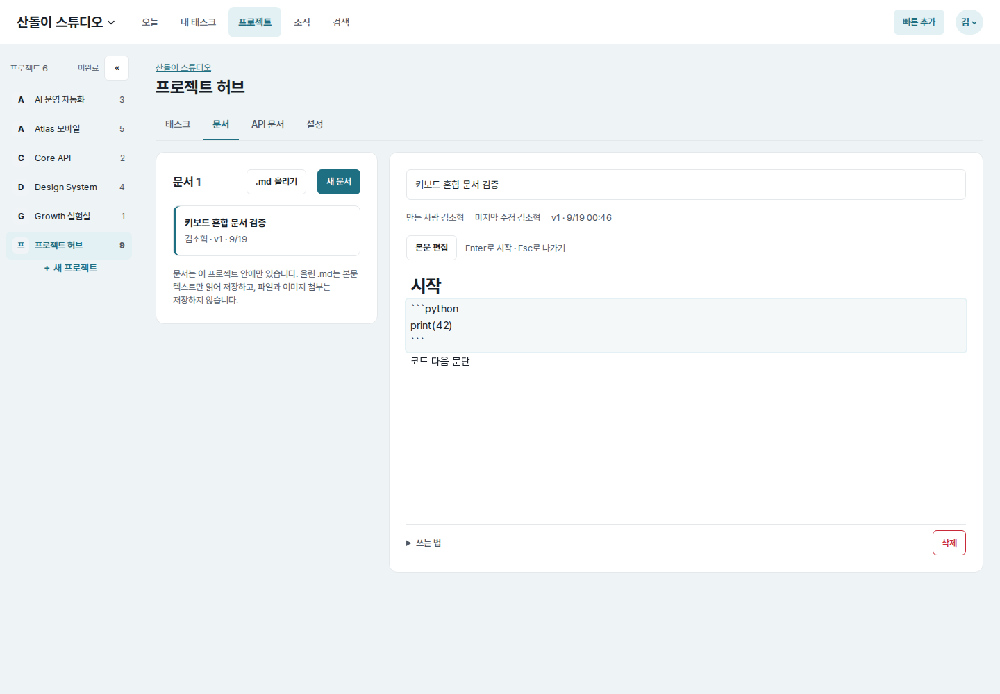
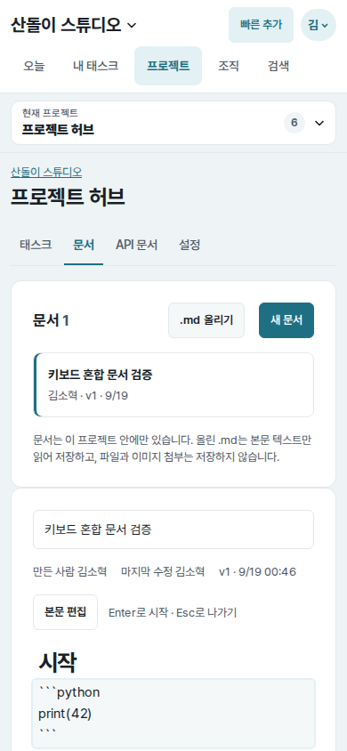
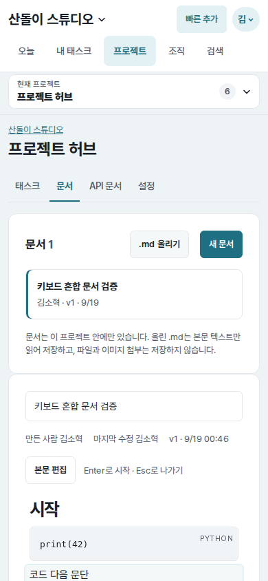

# UI evidence 15 — keyboard navigation across fenced code

## Why this changed

The final completion gate found one gap after keyboard entry was added to the
shared document editor. A fenced-code textarea returned before handling block
navigation, so ArrowDown at its end could not reach any following paragraph.
Because the explicit entry button starts at the first block, mixed documents
still required a pointer for content after code.

## Before and after

| Viewport | Before | After |
| --- | --- | --- |
| Desktop (`1440×1000`) |  |  |
| Mobile (`390×844`) |  |  |

Each pair uses the same mixed document (`heading → fenced code → paragraph`),
account, viewport, and light color scheme. The before images record focus stuck
in the raw fenced-code textarea. The after images record the code rendered and
the following paragraph active as an editor.

## Implementation and measured result

- Inside fenced code, ArrowUp at a collapsed offset zero now opens the preceding
  block and ArrowDown at a collapsed final offset opens the following block.
- Arrow keys anywhere else inside the code textarea retain native multiline
  caret movement. Non-collapsed selections, including Ctrl+A followed by
  ArrowUp, remain inside the textarea. Enter, Backspace, and Escape are unchanged.
- Forward browser verification traversed `# 시작` → complete fenced source →
  `코드 다음 문단` on desktop and mobile.
- Reverse verification traversed the paragraph → complete fenced source →
  heading, then Escape removed the editor and restored visible focus to
  `본문 편집` on both viewports.
- No text was changed or saved during the verification.

## Verification

- Shared document-entry and fenced-code navigation regression tests: passed.
- Browser checks covered forward/backward boundary navigation, Ctrl+A selection
  preservation, native code content, Escape focus restoration, desktop, and mobile.
- Full Core tests, Ruff lint/format, Django system check, JavaScript syntax, and
  `git diff --check`: passed.
